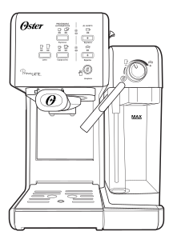
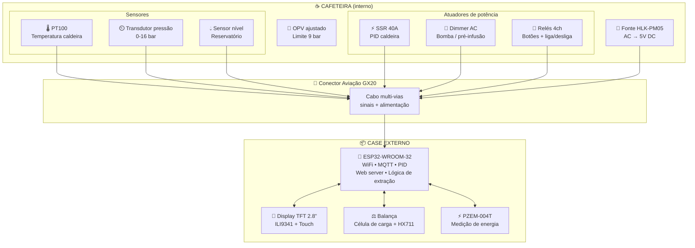
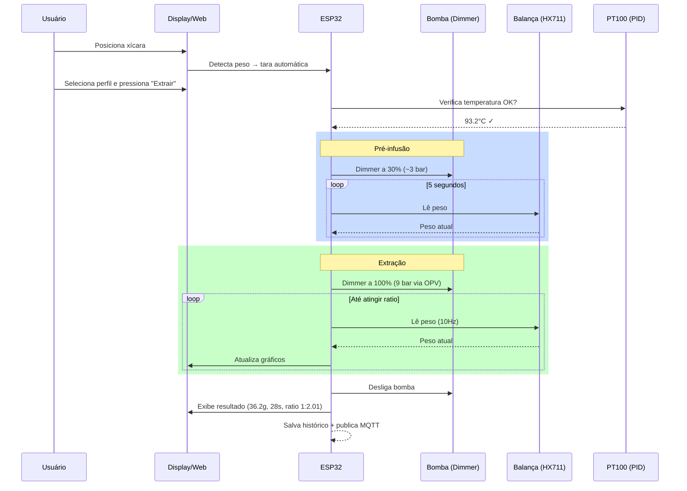
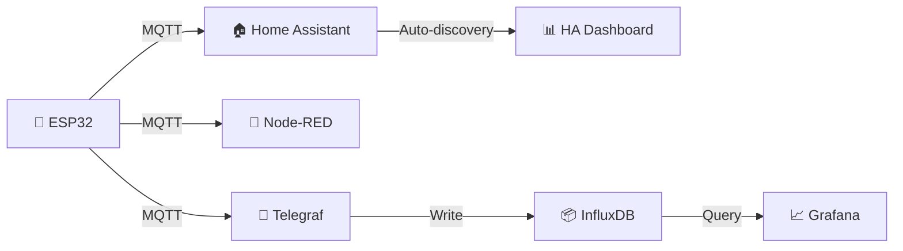

# ☕ IoT Oster Prima Latte 6701

  

Projeto de automação e instrumentação da cafeteira Oster Prima Latte II (modelo BVSTEM6701), transformando-a em uma máquina de espresso inteligente com controle total via ESP32.

## 🎯 Objetivos

- **Controle preciso de extração** — parar por ratio (peso) ou tempo
- **Monitoramento de pressão** — manômetro digital em tempo real
- **Estabilidade térmica** — PID digital para controle de temperatura da caldeira
- **Pré-infusão controlada** — dimmer digital para ajuste fino de pressão
- **Interface moderna** — display touch + interface web com histórico
- **Automação remota** — MQTT, métricas e controle liga/desliga
- **Monitoramento de energia** — consumo em tempo real

## 📐 Arquitetura Geral

A máquina não tem espaço interno para todos os componentes. A solução é manter apenas **sensores, atuadores de potência e fonte DC** dentro da cafeteira, e todo o restante (ESP32, display, balança, medidor de energia) em um **case externo**, conectado via **conector de aviação**.

### Fluxo de uma extração

## 📁 Estrutura do Projeto

| Arquivo | Descrição |
|---|---|
| `README.md` | Este arquivo — visão geral do projeto |
| `manual.pdf` | Manual original da cafeteira |
| [`docs/arquitetura.md`](docs/arquitetura.md) | Arquitetura detalhada do sistema |
| [`docs/componentes.md`](docs/componentes.md) | Lista de componentes (BOM) |
| [`docs/pinagem.md`](docs/pinagem.md) | Mapeamento de pinos do ESP32 |
| [`docs/sensores.md`](docs/sensores.md) | Detalhes dos sensores |
| [`docs/atuadores.md`](docs/atuadores.md) | Detalhes dos atuadores |
| [`docs/interface.md`](docs/interface.md) | Interface web e display touch |
| [`docs/mqtt.md`](docs/mqtt.md) | Tópicos e métricas MQTT |

## 🔧 Funcionalidades

### 1. Balança de Extração
- Célula de carga sob a base da xícara com módulo HX711
- Parada automática por **ratio** (ex: 1:2 para 18g dose → 36g extração)
- Parada automática por **tempo** (contagem a partir do início do fluxo)
- Tara automática ao posicionar a xícara

### 2. Controle de Nível do Reservatório
- Sensor ultrassônico ou capacitivo — percentual de água disponível
- Alerta de nível baixo via interface e MQTT

### 3. Manômetro Digital
- Transdutor de pressão 0-16 bar com leitura em tempo real
- Gráfico de pressão durante a extração

### 4. Ajuste do OPV
- Ajuste mecânico da Over Pressure Valve para limite de **9 bar**
- Validação via manômetro digital

### 5. Dimmer Digital (Pré-infusão)
- Dimmer AC com controle de fase da bomba vibratória
- Perfis de pré-infusão programáveis (rampa, pulsos, pressão constante)

### 6. PID de Temperatura
- PT100 na caldeira + SSR controlado por PID
- Substitui o termostato bimetálico original
- Estabilidade térmica ±1°C

### 7. Interface Web
- Dashboard em tempo real (temperatura, pressão, peso)
- Histórico de extrações com gráficos
- Configuração de perfis e PID
- OTA updates do firmware

### 8. Display Touch
- TFT ILI9341 2.8" com touch XPT2046
- Gráficos em tempo real durante extração
- Controle completo da máquina

### 9. Substituição dos Botões
- Relés em paralelo com os botões originais do painel
- Triggers digitais via ESP32, automação de sequências

### 10. Relé Principal
- Liga/desliga geral da máquina de forma remota
- Controle via MQTT / interface web / agendamento

### 11. Métricas de Energia
- Módulo PZEM-004T — tensão, corrente, potência, kWh, fator de potência
- Integração com Home Assistant via MQTT

## 🛠️ Stack Tecnológica

| Componente | Tecnologia |
|---|---|
| Microcontrolador | ESP32-WROOM-32 |
| Framework | Arduino / ESP-IDF via PlatformIO |
| Interface Web | ESPAsyncWebServer + LittleFS |
| Display | TFT ILI9341 + LVGL |
| Protocolo IoT | MQTT |
| Controle térmico | PID + SSR |

## 📊 Integrações

## ⚠️ Considerações de Segurança

- A máquina opera com **tensão de rede (127/220V AC)** — todo trabalho elétrico deve ser feito com a máquina **desligada e desconectada**
- Usar componentes isolados (SSR, optoacopladores) para separar circuitos AC e DC
- Manter o termostato bimetálico original como **backup de segurança** em série com o SSR
- O case externo deve ter ventilação adequada
- Manter aterramento adequado
- O conector de aviação deve suportar a corrente e tensão necessárias

## 📝 Status do Projeto

🟡 **Em planejamento** — documentação e levantamento de componentes

## 📄 Licença

Projeto pessoal e de código aberto. Use como referência para seus próprios mods de cafeteira.
