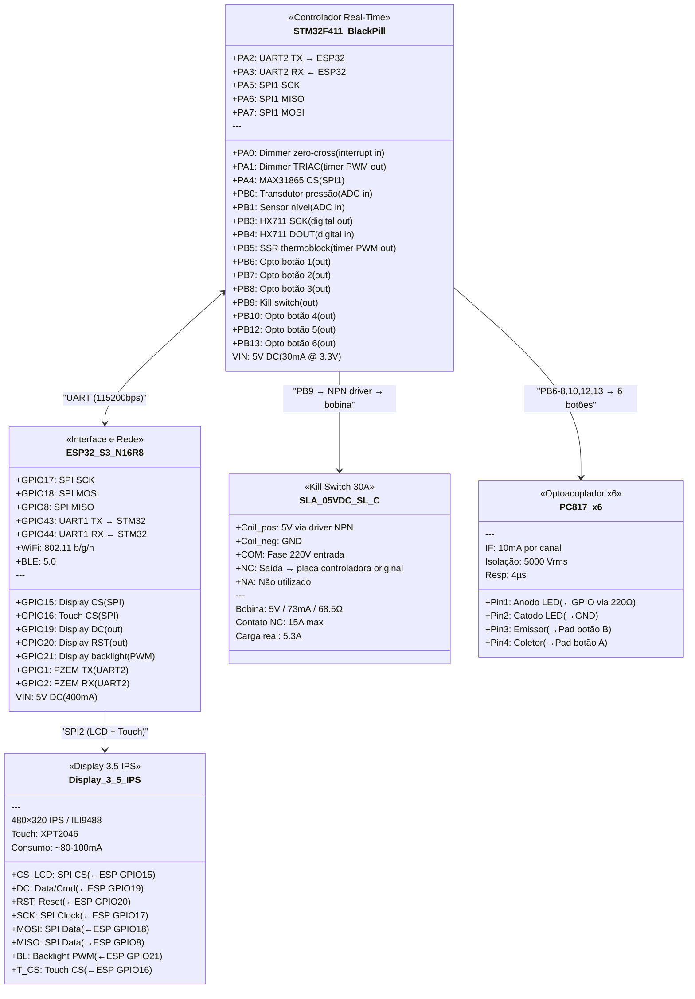
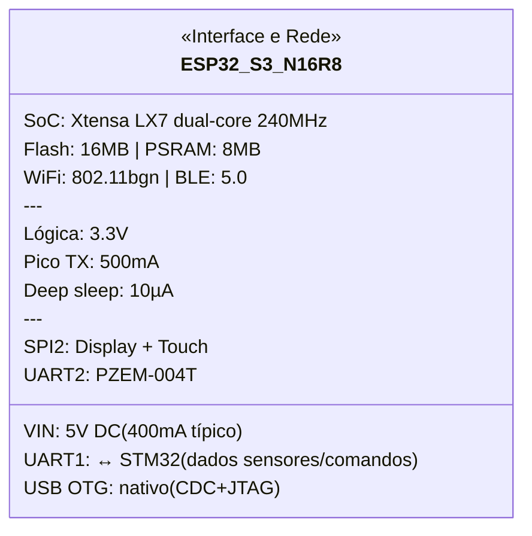
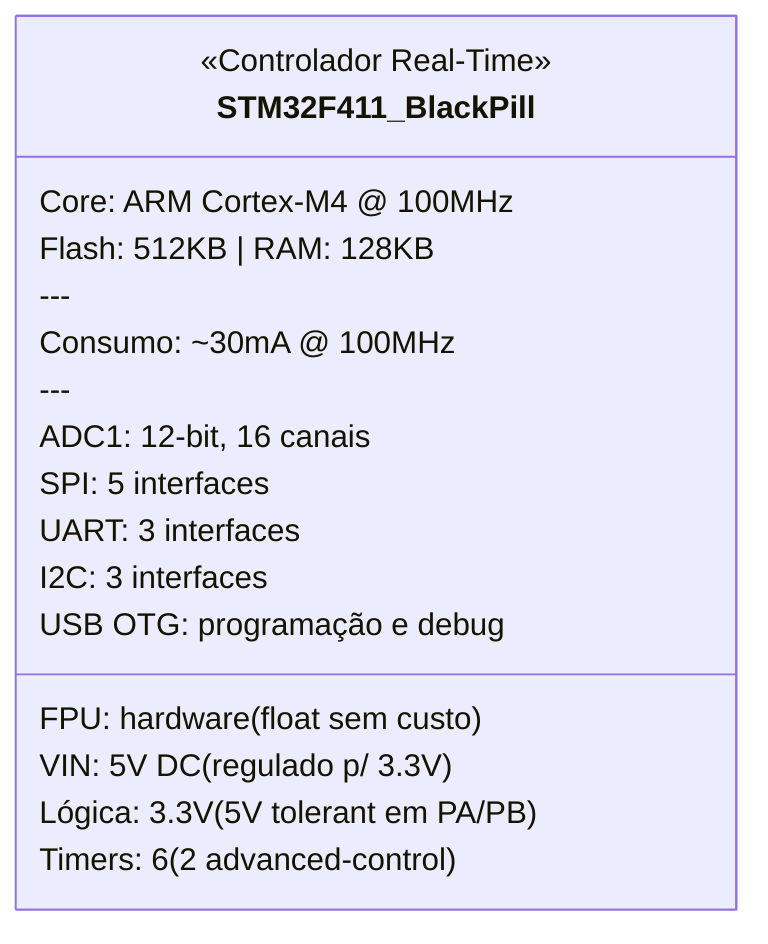
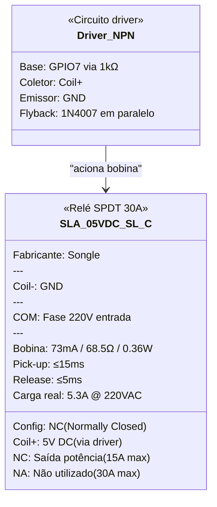
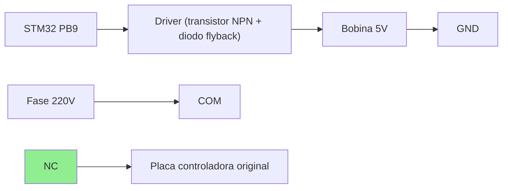
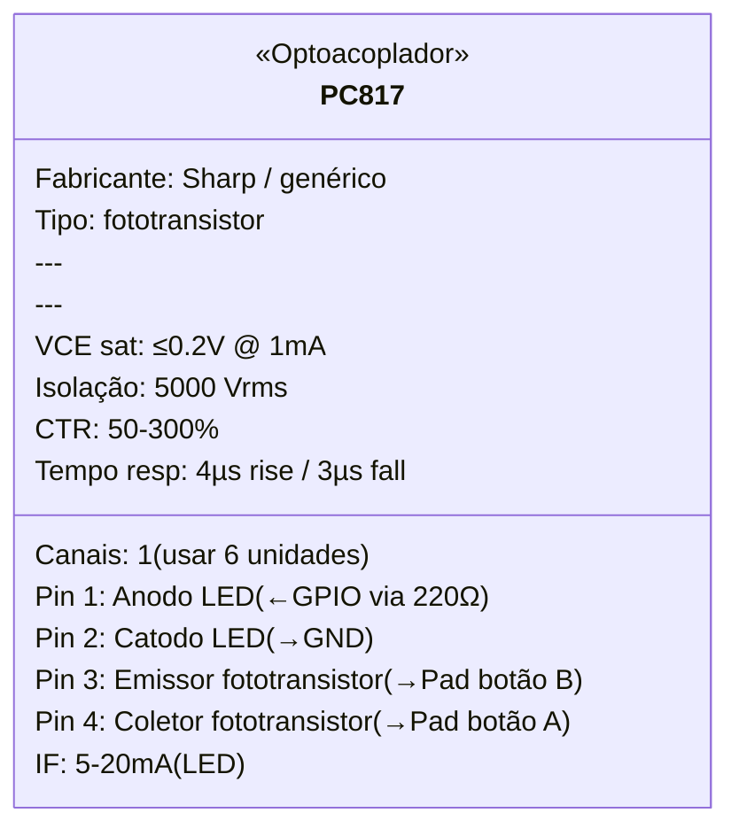
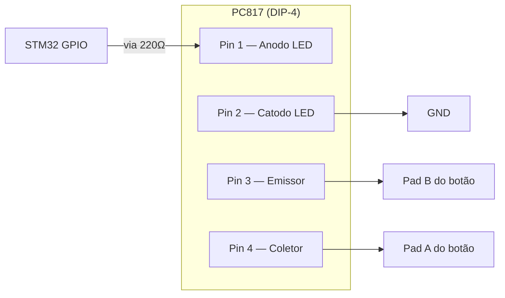
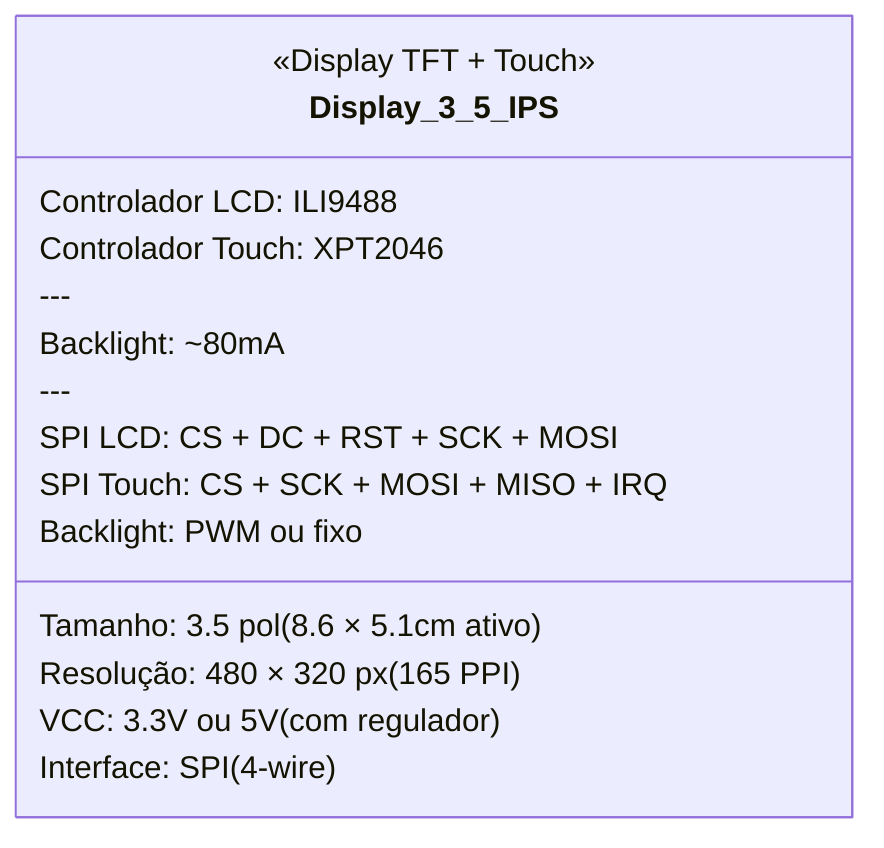
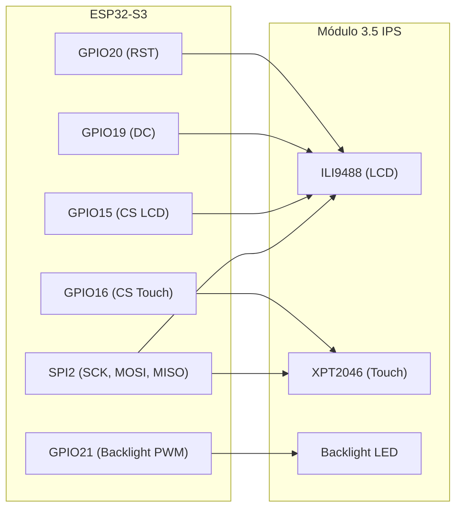

# Componentes — Especificações Detalhadas

Referência técnica de cada componente do projeto, com pinagem, consumo, protocolos e notas de integração.

## Visão geral (datasheet visual)



---

## 1. ESP32-S3-WROOM-1 N16R8

**Função:** Interface e comunicação — display LVGL, web server, API REST, MQTT, WebSocket, OTA. Recebe dados do STM32 via UART.

### Datasheet visual



### Especificações gerais

| Parâmetro | Valor |
|-----------|-------|
| SoC | ESP32-S3 (Xtensa LX7 dual-core @ 240 MHz) |
| Flash | 16 MB (Quad SPI) |
| PSRAM | 8 MB (Octal SPI) |
| WiFi | 802.11 b/g/n 2.4 GHz |
| Bluetooth | BLE 5.0 |
| GPIOs disponíveis | 45 (nem todos expostos no DevKit) |
| ADC | 2× SAR ADC, 20 canais, 12-bit |
| DAC | Não possui (usar PWM ou I2S) |
| SPI | 4 interfaces (SPI0/1 reservados para flash/PSRAM) |
| I2C | 2 interfaces |
| UART | 3 interfaces |
| USB | USB OTG nativo (CDC/JTAG) |
| Temperatura operação | -40°C a +85°C |

### Alimentação

| Parâmetro | Valor |
|-----------|-------|
| Tensão de entrada (pino VIN) | 5V DC (regulado internamente para 3.3V) |
| Tensão lógica (GPIOs) | 3.3V |
| Corrente média (WiFi ativo) | ~240 mA @ 3.3V |
| Corrente pico (TX WiFi) | ~500 mA |
| Corrente deep sleep | ~10 µA |
| Consumo total pelo 5V | ~400 mA (com margem) |

### Pinout relevante para o projeto

| GPIO | Função atribuída | Protocolo | Notas |
|------|-----------------|-----------|-------|
| 15 | Display CS | SPI (CS) | — |
| 16 | Touch CS (XPT2046) | SPI (CS) | — |
| 17 | SPI SCK | SPI | Compartilhado display + touch |
| 18 | SPI MOSI | SPI | Compartilhado |
| 8 | SPI MISO | SPI | Compartilhado |
| 19 | Display DC | Digital out | — |
| 20 | Display RST | Digital out | — |
| 21 | Display backlight | PWM | — |
| 43 | STM32 TX (ESP→STM) | UART1 TX | Comandos e config |
| 44 | STM32 RX (STM→ESP) | UART1 RX | Dados de sensores |
| 1 | PZEM TX | UART2 TX | Medição de energia |
| 2 | PZEM RX | UART2 RX | — |

### Notas de integração

- DevKits comuns (ex: ESP32-S3-DevKitC-1) já incluem regulador 3.3V, USB-C e botões BOOT/RST
- GPIOs 0, 45, 46 têm restrições no boot — evitar para funções críticas
- Flash e PSRAM ocupam GPIOs 26-37 no N16R8 — **não usar esses pinos**
- ADC2 não funciona com WiFi ativo — usar apenas ADC1 (GPIOs 1-10)
- **Não controla sensores/atuadores diretamente** — toda leitura e atuação passa pelo STM32 via UART
- Se o ESP32 reiniciar, o STM32 continua operando a máquina de forma segura

---

## 2. STM32F411CEU6 (WeAct BlackPill v3)

**Função:** Controlador real-time — PID do thermoblock, dimmer da bomba, leitura de sensores (peso, pressão, temperatura, nível), acionamento de relés. Opera independente do ESP32.

### Datasheet visual



### Especificações gerais

| Parâmetro | Valor |
|-----------|-------|
| Core | ARM Cortex-M4F @ 100 MHz |
| FPU | Sim (single-precision hardware) |
| Flash | 512 KB |
| RAM | 128 KB |
| ADC | 1× 12-bit SAR, 16 canais, 2.4 MSPS |
| Timers | 6 (TIM1, TIM2-5, TIM9-11) |
| UART | 3 (USART1, USART2, USART6) |
| SPI | 5 (SPI1-5) |
| I2C | 3 |
| USB | OTG FS |
| GPIOs | 36 (no encapsulamento UFQFPN48) |
| Tensão de operação | 1.7V–3.6V |
| 5V tolerant | Sim (maioria dos pinos PA/PB) |
| Temperatura operação | -40°C a +85°C |
| Encapsulamento DevKit | BlackPill — 2×20 headers, USB-C |

### Alimentação

| Parâmetro | Valor |
|-----------|-------|
| Tensão de entrada (pino 5V) | 5V DC (regulado internamente para 3.3V) |
| Tensão lógica (GPIOs) | 3.3V |
| Corrente típica (100MHz, periféricos ativos) | ~30 mA @ 3.3V |
| Corrente com todos ADC + timers | ~50 mA @ 3.3V |
| Consumo total pelo 5V | ~60 mA (com margem) |

### Pinout relevante para o projeto

| Pino | Função atribuída | Protocolo | Notas |
|------|-----------------|-----------|-------|
| PA0 | Dimmer zero-cross | EXTI (interrupt in) | TIM2_CH1 disponível se precisar |
| PA1 | Dimmer TRIAC | Timer PWM out | TIM2_CH2 — disparo sincronizado |
| PA2 | UART2 TX → ESP32 | USART2 TX | Envia dados de sensores |
| PA3 | UART2 RX ← ESP32 | USART2 RX | Recebe comandos |
| PA4 | MAX31865 CS | SPI1 (CS) | NSS manual |
| PA5 | SPI1 SCK | SPI1 | Compartilhado MAX31865 |
| PA6 | SPI1 MISO | SPI1 | Compartilhado MAX31865 |
| PA7 | SPI1 MOSI | SPI1 | Compartilhado MAX31865 |
| PB0 | Transdutor pressão | ADC1_CH8 | 0-3.3V (divisor resistivo se necessário) |
| PB1 | Sensor nível | ADC1_CH9 | Capacitivo, sinal analógico |
| PB3 | HX711 SCK | Digital out | Bit-bang, timing preciso |
| PB4 | HX711 DOUT | Digital in | Leitura 24-bit |
| PB5 | SSR thermoblock | Timer PWM out | TIM3_CH2 — PID slow PWM (~1-2Hz) |
| PB6 | Opto botão 1 | Digital out | Via resistor 220Ω → PC817 |
| PB7 | Opto botão 2 | Digital out | Via resistor 220Ω → PC817 |
| PB8 | Opto botão 3 | Digital out | Via resistor 220Ω → PC817 |
| PB9 | Kill switch | Digital out | NC — LOW = normal, HIGH = corte |
| PB10 | Opto botão 4 | Digital out | Via resistor 220Ω → PC817 |
| PB12 | Opto botão 5 | Digital out | Via resistor 220Ω → PC817 |
| PB13 | Opto botão 6 | Digital out | Via resistor 220Ω → PC817 |

**Pinos usados:** 20 de 36 disponíveis — **sobra confortável**

### Notas de integração

- **Opera independente** — se o ESP32 desligar/reiniciar, o STM32 mantém PID ativo e máquina segura
- **FPU hardware** — cálculos PID com float (Kp, Ki, Kd) sem penalidade de performance
- **Timers advanced** (TIM1) — pode ser usado futuramente para pressure profiling mais sofisticado
- **5V tolerant** — pode receber sinais de módulos 5V diretamente (HX711, relés) sem level shifter
- Comunicação com ESP32 via UART a **115200 bps** (suficiente para ~100 atualizações/s de todos os sensores)
- Protocolo sugerido: pacotes binários com header + checksum (tipo Modbus simplificado) ou MessagePack

### Responsabilidades (divisão STM32 ↔ ESP32)

| STM32 (real-time) | ESP32 (interface) |
|--------------------|-------------------|
| PID thermoblock (SSR) | Display LVGL |
| Dimmer bomba (zero-cross) | Web server + API REST |
| Leitura HX711 (peso) | MQTT publish |
| Leitura MAX31865 (temp) | WebSocket (gráficos live) |
| Leitura pressão (ADC) | OTA de ambos (self + STM32) |
| Leitura nível (ADC) | Histórico de shots |
| Acionamento relés (botões) | Beanconqueror BLE |
| Kill switch | PZEM-004T (energia) |
| Lógica de segurança (timeout, over-temp) | Configurações e perfis |

---

## 3. SLA-05VDC-SL-C (Songle 30A)

**Função:** Kill switch de segurança — corte da alimentação AC da **placa controladora original** da cafeteira. Ao desenergizar a placa, thermoblock, bomba e válvulas param. O disjuntor geral (botão físico na lateral da máquina) permanece como corte total.

### Datasheet visual



### Especificações gerais

| Parâmetro | Valor |
|-----------|-------|
| Fabricante | Songle |
| Modelo | SLA-05VDC-SL-C |
| Tipo de contato | SPDT (1 NA + 1 NF + 1 COM) |
| Configuração no projeto | **NF (Normally Closed)** — corta ao energizar |
| Corrente máxima (NA) | 30A @ 250VAC |
| Corrente máxima (NF) | 15A @ 250VAC |
| Tensão máxima | 250VAC / 30VDC |
| Carga do projeto | ~5.3A @ 220VAC (1170W) |
| Margem de segurança | ~3x no NF |

### Bobina (lado controle)

| Parâmetro | Valor |
|-----------|-------|
| Tensão nominal | 5V DC |
| Corrente da bobina | ~73 mA |
| Resistência da bobina | ~68.5Ω |
| Potência da bobina | ~0.36W |
| Tempo de atuação (pick-up) | ≤ 15 ms |
| Tempo de liberação | ≤ 5 ms |

### Pinagem física

```
         ┌─────────────────┐
         │   SLA-05VDC-SL-C │
         └─────────────────┘

Bobina (lado inferior):
  Pin 1: Coil (+)  ← 5V via driver
  Pin 2: Coil (-)  ← GND

Contatos (lado superior):
  COM:  Comum       ← Fase 220V (entrada)
  NC:   Norm. Closed ← Saída para thermoblock + bomba
  NA:   Norm. Open   ← Não utilizado
```

### Diagrama de ligação no projeto



### Lógica de operação

| Estado do GPIO | Bobina | Contato NC | Placa original | ESP32 + STM32 |
|---------------|--------|-----------|----------------|---------------|
| **LOW** (padrão) | Desenergizada | **Fechado** | ✅ Energizada | ✅ Online |
| **HIGH** (emergência) | Energizada | **Aberto** | ❌ Sem energia | ✅ Online |
| **STM32 reiniciando** | Desenergizada | **Fechado** | ✅ Energizada | ✅ Online |
| **Falha total (sem 5V)** | Desenergizada | **Fechado** | ✅ Energizada | ❌ Offline |
| **Disjuntor lateral OFF** | — | — | ❌ Tudo desligado | ❌ Tudo desligado |

### Driver necessário

O STM32 fornece ~25mA por GPIO, insuficiente para os 73mA da bobina. Necessário:

- **Transistor NPN** (ex: BC337, 2N2222) — saturação com base via resistor 1kΩ
- **Diodo flyback** (ex: 1N4007) — proteção contra back-EMF ao desligar a bobina
- Ou usar **módulo relé 1 canal com optoacoplador** (já inclui tudo)

### Notas de integração

- Operação NC garante que a placa original **não desliga** se o STM32 reiniciar ou perder energia
- O kill switch corta a **placa controladora original** da cafeteira — sem ela, thermoblock, bomba e válvulas ficam inoperantes
- **Não é o controle funcional** — quem liga/desliga thermoblock e bomba no dia-a-dia são o SSR e o dimmer
- É uma camada de segurança para corte de emergência (remoto ou por condição anômala detectada pelo STM32)
- ESP32 + STM32 permanecem online (alimentados pela fonte DC separada) — podem reportar o evento e religar remotamente
- O **disjuntor geral** (botão físico na lateral da cafeteira) continua como corte total de tudo
- Considerar adicionar um LED indicador no case externo para sinalizar quando o kill switch está ativo (placa original sem energia)

---

## 4. PC817 — Optoacoplador (×6)

**Função:** Simular acionamento dos 6 botões do painel da máquina (clique simples e press-and-hold) via STM32, em paralelo com os botões físicos.

### Datasheet visual



### Especificações gerais

| Parâmetro | Valor |
|-----------|-------|
| Fabricante | Sharp (original) / genéricos compatíveis |
| Encapsulamento | DIP-4 |
| Tipo | Fototransistor |
| Canais | 1 por unidade (6 unidades no projeto) |
| Tensão de isolação | 5000 Vrms |
| CTR (Current Transfer Ratio) | 50–300% @ IF=5mA, VCE=5V |
| Tempo de resposta | ~4µs (rise) / ~3µs (fall) |
| Temperatura de operação | -30°C a +100°C |

### Lado de entrada (LED infravermelho — pinos 1 e 2)

| Parâmetro | Valor |
|-----------|-------|
| Tensão direta (VF) | ~1.2V @ IF=20mA |
| Corrente direta (IF) | 5–20 mA (recomendado) |
| Corrente máxima (IF max) | 50 mA |
| Resistor limitador | **220Ω** (para 3.3V e ~10mA) |
| Cálculo | (3.3V − 1.2V) / 10mA = 210Ω → **220Ω padrão** |

### Lado de saída (fototransistor — pinos 3 e 4)

| Parâmetro | Valor |
|-----------|-------|
| VCE saturação | ≤ 0.2V @ IC=1mA |
| Corrente coletor máx (IC) | 50 mA |
| Uso no projeto | Fecha o circuito entre os 2 pads do botão |

### Pinagem física



### Mapeamento dos 6 botões

| # | Botão | GPIO STM32 | 1 clique | 2 cliques | Hold / clique+hold |
|---|-------|-----------|----------|-----------|---------------------|
| 1 | Expresso | PB6 | Café curto | Café lungo | Calibra curto / Calibra lungo |
| 2 | Al Gusto | PB7 | Inicia extração livre | Para a extração | — |
| 3 | Latte | PB8 | Café curto (com leite) | Café lungo (com leite) | Calibra curto / Calibra lungo |
| 4 | Cappuccino | PB10 | Café curto (com espuma) | Café lungo (com espuma) | Calibra curto / Calibra lungo |
| 5 | Espuma | PB12 | Inicia vaporização do leite | Para a vaporização | — |
| 6 | Limpeza | PB13 | Ciclo de limpeza (15bar, 120°C, timer fixo) | — | — |

### Lógica de acionamento

Os botões da Prima Latte têm 3 modos de interação:

| Ação | Comportamento | STM32 simula |
|------|--------------|--------------|
| **1 clique** | Extração curta (volume pré-definido) | Pulso `HIGH` ~150ms |
| **2 cliques** | Extração lungo (volume pré-definido) | 2 pulsos de ~150ms |
| **Clicar e segurar** | Calibrar volume do curto (para ao soltar) | `HIGH` sustentado → `LOW` ao soltar |
| **1 clique + segurar no 2º** | Calibrar volume do lungo (para ao soltar) | Pulso ~150ms + pausa + `HIGH` sustentado → `LOW` |

> **Nota:** No uso via IoT, a calibração por hold provavelmente não será utilizada — o STM32 controla parada por peso (ratio), tempo ou comando do usuário via Al Gusto. Mas o optoacoplador suporta hold sem problemas (estado sólido, sem desgaste).

| Estado GPIO | Significado |
|-------------|-------------|
| `LOW` | Inativo (botão "solto") |
| `HIGH` por ~150ms | Clique simples |
| `HIGH` sustentado | Botão "pressionado" (calibração) |

### Consumo

| Cenário | Corrente total (6 unidades) |
|---------|----------------------------|
| Todos inativos | 0 mA |
| 1 botão ativo | ~10 mA |
| Pior caso (todos ativos) | ~60 mA |
| **Operação típica** | **~10 mA** (1 botão por vez) |

### Notas de integração

- Soldado **em paralelo** com cada botão físico — os botões originais continuam funcionando
- **Isolação galvânica total** entre STM32 e placa da máquina (5000 Vrms)
- Resposta de ~4µs é ordens de grandeza mais rápida que o debounce de qualquer botão mecânico
- Sem desgaste mecânico (estado sólido) — vida útil essencialmente infinita
- Sem ruído audível (ao contrário de relés)
- Cada PC817 precisa de 1 resistor de 220Ω (total: 6 resistores)
- Se a placa interna usar lógica invertida (pull-up), o fototransistor funciona igualmente — só fecha o contato

---

## 5. Display TFT 3.5" IPS — ILI9488 + XPT2046

**Função:** Interface visual e tátil para controle local da máquina — gráficos de extração em tempo real, temperatura, pressão, controles de perfil e status. Renderizado via LVGL no ESP32-S3.

### Datasheet visual



### Dimensões do painel frontal da cafeteira

O painel frontal da Oster Prima Latte II mede **12 × 9 cm**. Considerando uma borda de ~1 cm para encaixe/moldura, a área útil para o display é de aproximadamente **10 × 7 cm** — comporta com folga o módulo 3.5" (93 × 59 mm).

### Especificações gerais

| Parâmetro | Valor |
|-----------|-------|
| Tamanho | 3.5 polegadas |
| Tipo de painel | IPS (ângulo de visão ~170°) |
| Resolução | 480 × 320 pixels |
| PPI | ~165 |
| Profundidade de cor | 262K (RGB666) / 16.7M (RGB888) |
| Controlador LCD | ILI9488 |
| Controlador touch | XPT2046 (resistivo) ou GT911 (capacitivo) |
| Interface | SPI (4-wire), até 80MHz |
| Área ativa | ~86 × 51 mm |
| Dimensão total do módulo | ~93 × 59 mm |
| Ângulo de visão | ~170° (IPS) |

### Alimentação

| Parâmetro | Valor |
|-----------|-------|
| Tensão de entrada | 3.3V ou 5V (módulos comuns têm regulador onboard) |
| Corrente LCD | ~20 mA |
| Corrente backlight | ~60-80 mA (depende do brilho) |
| Consumo total | **~80-100 mA** |

### Pinagem (conexão com ESP32-S3)

| Pino do módulo | GPIO ESP32 | Função | Notas |
|----------------|-----------|--------|-------|
| CS (LCD) | GPIO15 | SPI Chip Select LCD | — |
| DC / RS | GPIO19 | Data/Command select | — |
| RST | GPIO20 | Reset LCD | — |
| SCK | GPIO17 | SPI Clock | Compartilhado com touch |
| MOSI / SDA | GPIO18 | SPI Master Out | Compartilhado com touch |
| MISO | GPIO8 | SPI Master In | Compartilhado (usado pelo touch) |
| LED / BL | GPIO21 | Backlight (PWM) | Dimmer por software |
| T_CS | GPIO16 | SPI Chip Select touch | — |
| T_IRQ | — | Touch interrupt | Opcional (pode usar polling) |
| VCC | 3.3V | Alimentação | — |
| GND | GND | — | — |

**Total: 8 GPIOs do ESP32** (CS, DC, RST, SCK, MOSI, MISO, BL, T_CS)

### Diagrama de ligação



### Notas de integração

- SPI compartilhado entre LCD e touch — alternado via Chip Select (CS)
- Clock SPI recomendado: **40MHz para LCD**, **2.5MHz para touch** (XPT2046 é mais lento)
- LVGL configurado com buffer de ~480×40 linhas (~38KB) — cabe no PSRAM
- Backlight via PWM permite ajuste de brilho (economia de energia, conforto visual)
- IPS garante ângulo de visão amplo — legível de qualquer posição na bancada
- Módulos de 3.5" são facilmente encontrados no AliExpress/Amazon por R$30-60
- Se quiser upgrade futuro para capacitivo, existem módulos 3.5" com GT911 (drop-in, mesma interface SPI)
- Resolução 480×320 é suficiente para LVGL com gráficos de extração, gauges e botões touch

---

## Validação do sistema

### Balanço energético (barramento 5V — fonte HLK-PM05)

| Componente | Consumo 5V | Notas |
|---|---|---|
| ESP32-S3 N16R8 | ~400 mA | WiFi + LVGL + WebSocket |
| STM32F411 BlackPill | ~60 mA | 100MHz + periféricos |
| Kill switch (bobina via driver) | ~73 mA | Só quando ativado (emergência) |
| 6× PC817 (optoacopladores) | ~10 mA | Típico: 1 botão por vez (~60mA pior caso) |
| HX711 | ~1.5 mA | — |
| MAX31865 | ~3 mA | — |
| Sensor nível | ~10 mA | — |
| Display TFT 3.5" IPS | ~100 mA | ILI9488 + backlight |
| **TOTAL (pior caso)** | **~708 mA** | — |
| **TOTAL (operação típica)** | **~585 mA** | Kill switch inativo, 1 opto |

### ⚠️ Fonte de alimentação

Com a troca de relés 3ch por optoacopladores, o consumo de pior caso caiu de ~838mA para **~688mA**.

| Fonte | Capacidade | Status |
|---|---|---|
| HLK-PM05 | 600 mA | ❌ Insuficiente (pior caso 688mA) |
| **HLK-5M05** | **1000 mA** | ✅ Recomendada (margem de ~45%) |
| HLK-10M05 | 2000 mA | Overkill mas segura |

A HLK-PM05 ainda não cabe no pior caso (688mA > 600mA), mas a margem ficou mais apertada. A **HLK-5M05 (5V/1A)** continua sendo a escolha recomendada — agora com margem ainda mais confortável.

### Balanço de pinos

| Controlador | Pinos usados | Pinos disponíveis | Margem |
|---|---|---|---|
| ESP32-S3 | 12 | ~25 usáveis | ✅ 13 livres |
| STM32F411 | 20 | 36 | ✅ 16 livres |

### Comunicação entre controladores

| Parâmetro | Valor |
|---|---|
| Interface | UART (ESP32 UART1 ↔ STM32 USART2) |
| Baud rate | 115200 bps |
| Nível lógico | 3.3V (ambos — sem level shifter) |
| Direção | Bidirecional |
| STM32 → ESP32 | Dados de sensores (peso, temp, pressão, nível, estado) |
| ESP32 → STM32 | Comandos (setpoint PID, iniciar extração, perfil dimmer, kill) |

