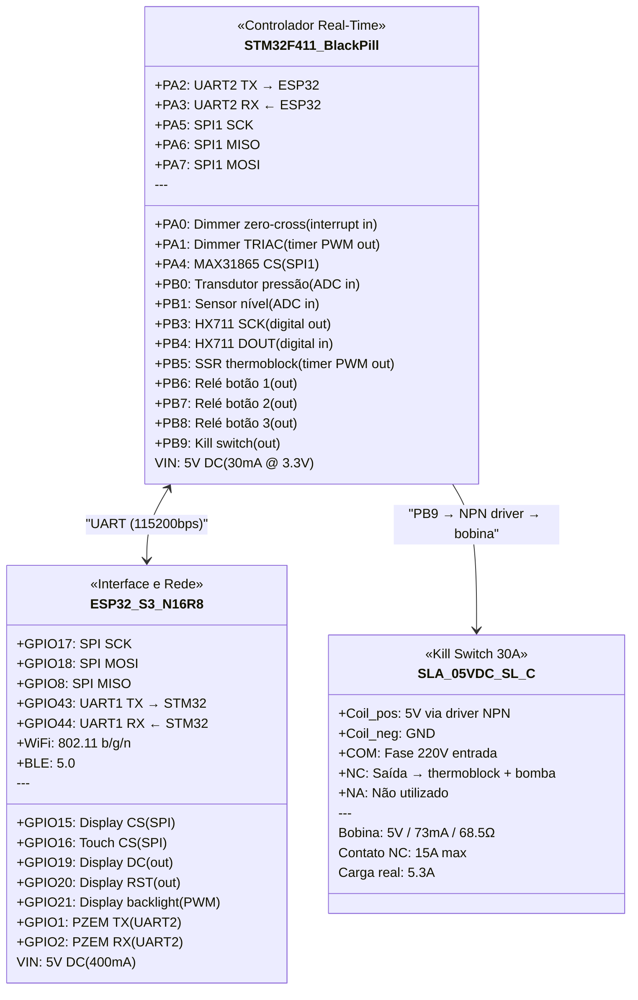
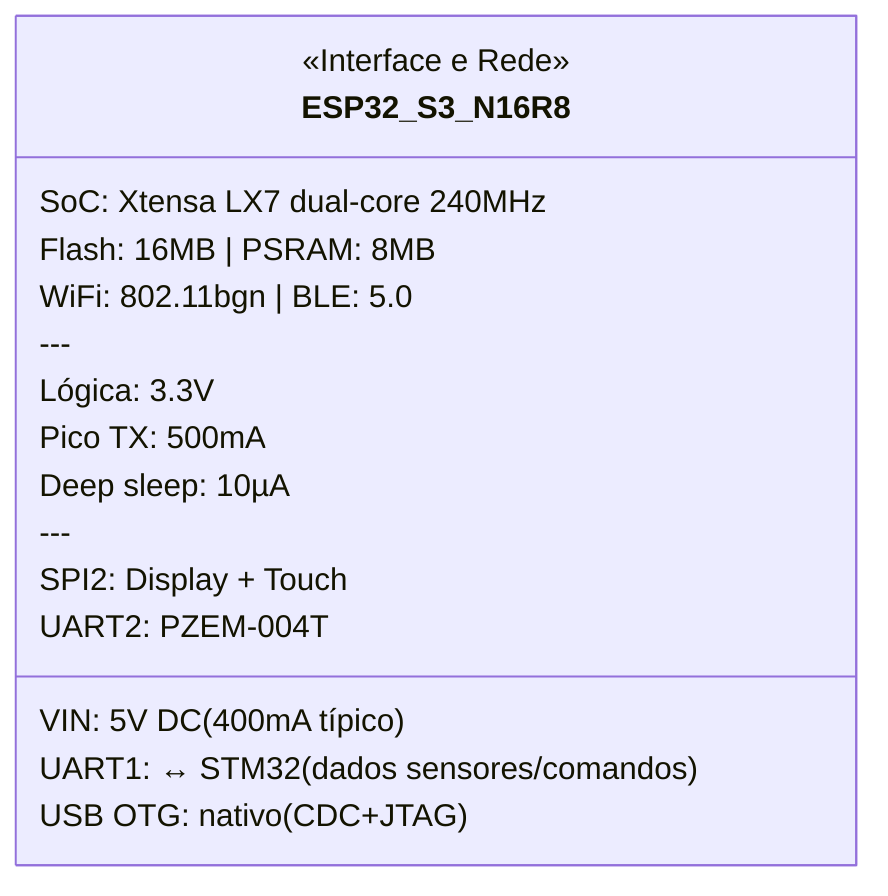
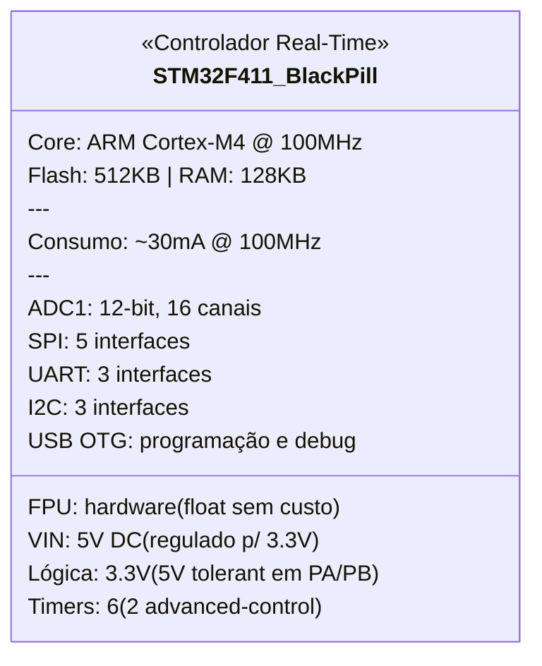
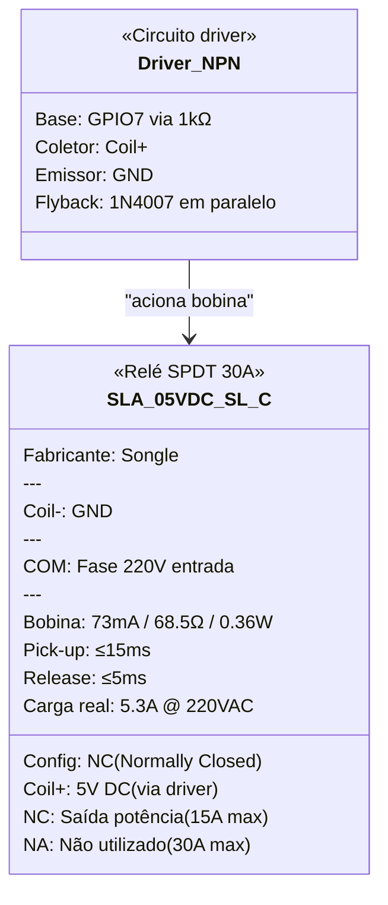
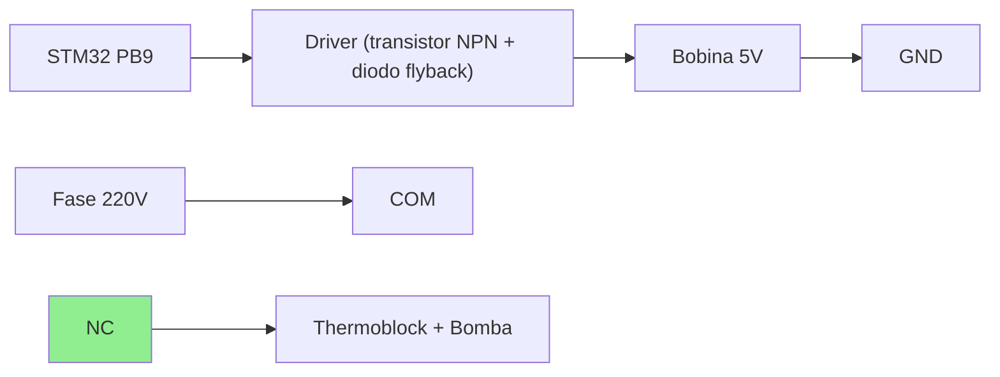

# Componentes — Especificações Detalhadas

Referência técnica de cada componente do projeto, com pinagem, consumo, protocolos e notas de integração.

## Visão geral (datasheet visual)



---

## 1. ESP32-S3-WROOM-1 N16R8

**Função:** Interface e comunicação — display LVGL, web server, API REST, MQTT, WebSocket, OTA. Recebe dados do STM32 via UART.

### Datasheet visual



### Especificações gerais

| Parâmetro | Valor |
|-----------|-------|
| SoC | ESP32-S3 (Xtensa LX7 dual-core @ 240 MHz) |
| Flash | 16 MB (Quad SPI) |
| PSRAM | 8 MB (Octal SPI) |
| WiFi | 802.11 b/g/n 2.4 GHz |
| Bluetooth | BLE 5.0 |
| GPIOs disponíveis | 45 (nem todos expostos no DevKit) |
| ADC | 2× SAR ADC, 20 canais, 12-bit |
| DAC | Não possui (usar PWM ou I2S) |
| SPI | 4 interfaces (SPI0/1 reservados para flash/PSRAM) |
| I2C | 2 interfaces |
| UART | 3 interfaces |
| USB | USB OTG nativo (CDC/JTAG) |
| Temperatura operação | -40°C a +85°C |

### Alimentação

| Parâmetro | Valor |
|-----------|-------|
| Tensão de entrada (pino VIN) | 5V DC (regulado internamente para 3.3V) |
| Tensão lógica (GPIOs) | 3.3V |
| Corrente média (WiFi ativo) | ~240 mA @ 3.3V |
| Corrente pico (TX WiFi) | ~500 mA |
| Corrente deep sleep | ~10 µA |
| Consumo total pelo 5V | ~400 mA (com margem) |

### Pinout relevante para o projeto

| GPIO | Função atribuída | Protocolo | Notas |
|------|-----------------|-----------|-------|
| 15 | Display CS | SPI (CS) | — |
| 16 | Touch CS (XPT2046) | SPI (CS) | — |
| 17 | SPI SCK | SPI | Compartilhado display + touch |
| 18 | SPI MOSI | SPI | Compartilhado |
| 8 | SPI MISO | SPI | Compartilhado |
| 19 | Display DC | Digital out | — |
| 20 | Display RST | Digital out | — |
| 21 | Display backlight | PWM | — |
| 43 | STM32 TX (ESP→STM) | UART1 TX | Comandos e config |
| 44 | STM32 RX (STM→ESP) | UART1 RX | Dados de sensores |
| 1 | PZEM TX | UART2 TX | Medição de energia |
| 2 | PZEM RX | UART2 RX | — |

### Notas de integração

- DevKits comuns (ex: ESP32-S3-DevKitC-1) já incluem regulador 3.3V, USB-C e botões BOOT/RST
- GPIOs 0, 45, 46 têm restrições no boot — evitar para funções críticas
- Flash e PSRAM ocupam GPIOs 26-37 no N16R8 — **não usar esses pinos**
- ADC2 não funciona com WiFi ativo — usar apenas ADC1 (GPIOs 1-10)
- **Não controla sensores/atuadores diretamente** — toda leitura e atuação passa pelo STM32 via UART
- Se o ESP32 reiniciar, o STM32 continua operando a máquina de forma segura

---

## 2. STM32F411CEU6 (WeAct BlackPill v3)

**Função:** Controlador real-time — PID do thermoblock, dimmer da bomba, leitura de sensores (peso, pressão, temperatura, nível), acionamento de relés. Opera independente do ESP32.

### Datasheet visual



### Especificações gerais

| Parâmetro | Valor |
|-----------|-------|
| Core | ARM Cortex-M4F @ 100 MHz |
| FPU | Sim (single-precision hardware) |
| Flash | 512 KB |
| RAM | 128 KB |
| ADC | 1× 12-bit SAR, 16 canais, 2.4 MSPS |
| Timers | 6 (TIM1, TIM2-5, TIM9-11) |
| UART | 3 (USART1, USART2, USART6) |
| SPI | 5 (SPI1-5) |
| I2C | 3 |
| USB | OTG FS |
| GPIOs | 36 (no encapsulamento UFQFPN48) |
| Tensão de operação | 1.7V–3.6V |
| 5V tolerant | Sim (maioria dos pinos PA/PB) |
| Temperatura operação | -40°C a +85°C |
| Encapsulamento DevKit | BlackPill — 2×20 headers, USB-C |

### Alimentação

| Parâmetro | Valor |
|-----------|-------|
| Tensão de entrada (pino 5V) | 5V DC (regulado internamente para 3.3V) |
| Tensão lógica (GPIOs) | 3.3V |
| Corrente típica (100MHz, periféricos ativos) | ~30 mA @ 3.3V |
| Corrente com todos ADC + timers | ~50 mA @ 3.3V |
| Consumo total pelo 5V | ~60 mA (com margem) |

### Pinout relevante para o projeto

| Pino | Função atribuída | Protocolo | Notas |
|------|-----------------|-----------|-------|
| PA0 | Dimmer zero-cross | EXTI (interrupt in) | TIM2_CH1 disponível se precisar |
| PA1 | Dimmer TRIAC | Timer PWM out | TIM2_CH2 — disparo sincronizado |
| PA2 | UART2 TX → ESP32 | USART2 TX | Envia dados de sensores |
| PA3 | UART2 RX ← ESP32 | USART2 RX | Recebe comandos |
| PA4 | MAX31865 CS | SPI1 (CS) | NSS manual |
| PA5 | SPI1 SCK | SPI1 | Compartilhado MAX31865 |
| PA6 | SPI1 MISO | SPI1 | Compartilhado MAX31865 |
| PA7 | SPI1 MOSI | SPI1 | Compartilhado MAX31865 |
| PB0 | Transdutor pressão | ADC1_CH8 | 0-3.3V (divisor resistivo se necessário) |
| PB1 | Sensor nível | ADC1_CH9 | Capacitivo, sinal analógico |
| PB3 | HX711 SCK | Digital out | Bit-bang, timing preciso |
| PB4 | HX711 DOUT | Digital in | Leitura 24-bit |
| PB5 | SSR thermoblock | Timer PWM out | TIM3_CH2 — PID slow PWM (~1-2Hz) |
| PB6 | Relé botão 1 | Digital out | Via driver |
| PB7 | Relé botão 2 | Digital out | Via driver |
| PB8 | Relé botão 3 | Digital out | Via driver |
| PB9 | Kill switch | Digital out | NC — LOW = normal, HIGH = corte |

**Pinos usados:** 17 de 36 disponíveis — **sobra confortável**

### Notas de integração

- **Opera independente** — se o ESP32 desligar/reiniciar, o STM32 mantém PID ativo e máquina segura
- **FPU hardware** — cálculos PID com float (Kp, Ki, Kd) sem penalidade de performance
- **Timers advanced** (TIM1) — pode ser usado futuramente para pressure profiling mais sofisticado
- **5V tolerant** — pode receber sinais de módulos 5V diretamente (HX711, relés) sem level shifter
- Comunicação com ESP32 via UART a **115200 bps** (suficiente para ~100 atualizações/s de todos os sensores)
- Protocolo sugerido: pacotes binários com header + checksum (tipo Modbus simplificado) ou MessagePack

### Responsabilidades (divisão STM32 ↔ ESP32)

| STM32 (real-time) | ESP32 (interface) |
|--------------------|-------------------|
| PID thermoblock (SSR) | Display LVGL |
| Dimmer bomba (zero-cross) | Web server + API REST |
| Leitura HX711 (peso) | MQTT publish |
| Leitura MAX31865 (temp) | WebSocket (gráficos live) |
| Leitura pressão (ADC) | OTA de ambos (self + STM32) |
| Leitura nível (ADC) | Histórico de shots |
| Acionamento relés (botões) | Beanconqueror BLE |
| Kill switch | PZEM-004T (energia) |
| Lógica de segurança (timeout, over-temp) | Configurações e perfis |

---

## 3. SLA-05VDC-SL-C (Songle 30A)

**Função:** Kill switch de segurança — corte físico de emergência da potência AC (thermoblock + bomba).

### Datasheet visual



### Especificações gerais

| Parâmetro | Valor |
|-----------|-------|
| Fabricante | Songle |
| Modelo | SLA-05VDC-SL-C |
| Tipo de contato | SPDT (1 NA + 1 NF + 1 COM) |
| Configuração no projeto | **NF (Normally Closed)** — corta ao energizar |
| Corrente máxima (NA) | 30A @ 250VAC |
| Corrente máxima (NF) | 15A @ 250VAC |
| Tensão máxima | 250VAC / 30VDC |
| Carga do projeto | ~5.3A @ 220VAC (1170W) |
| Margem de segurança | ~3x no NF |

### Bobina (lado controle)

| Parâmetro | Valor |
|-----------|-------|
| Tensão nominal | 5V DC |
| Corrente da bobina | ~73 mA |
| Resistência da bobina | ~68.5Ω |
| Potência da bobina | ~0.36W |
| Tempo de atuação (pick-up) | ≤ 15 ms |
| Tempo de liberação | ≤ 5 ms |

### Pinagem física

```
         ┌─────────────────┐
         │   SLA-05VDC-SL-C │
         └─────────────────┘

Bobina (lado inferior):
  Pin 1: Coil (+)  ← 5V via driver
  Pin 2: Coil (-)  ← GND

Contatos (lado superior):
  COM:  Comum       ← Fase 220V (entrada)
  NC:   Norm. Closed ← Saída para thermoblock + bomba
  NA:   Norm. Open   ← Não utilizado
```

### Diagrama de ligação no projeto



### Lógica de operação

| Estado do GPIO | Bobina | Contato NC | Máquina |
|---------------|--------|-----------|---------|
| **LOW** (padrão) | Desenergizada | **Fechado** | ✅ Funcionando |
| **HIGH** (emergência) | Energizada | **Aberto** | ❌ Potência cortada |
| **STM32 reiniciando** | Desenergizada | **Fechado** | ✅ Funcionando |
| **Falha total (sem 5V)** | Desenergizada | **Fechado** | ✅ Funcionando |

### Driver necessário

O STM32 fornece ~25mA por GPIO, insuficiente para os 73mA da bobina. Necessário:

- **Transistor NPN** (ex: BC337, 2N2222) — saturação com base via resistor 1kΩ
- **Diodo flyback** (ex: 1N4007) — proteção contra back-EMF ao desligar a bobina
- Ou usar **módulo relé 1 canal com optoacoplador** (já inclui tudo)

### Notas de integração

- Operação NC garante que a máquina **não desliga** se o STM32 reiniciar ou perder energia
- O kill switch **não é o controle funcional** — quem liga/desliga thermoblock e bomba são o SSR e o dimmer
- É apenas uma camada de segurança para corte de emergência (remoto ou por condição anômala detectada pelo STM32)
- Considerar adicionar um LED indicador no case externo para sinalizar quando o kill switch está ativo (potência cortada)

---

## Validação do sistema

### Balanço energético (barramento 5V — fonte HLK-PM05)

| Componente | Consumo 5V | Notas |
|---|---|---|
| ESP32-S3 N16R8 | ~400 mA | WiFi + LVGL + WebSocket |
| STM32F411 BlackPill | ~60 mA | 100MHz + periféricos |
| Kill switch (bobina via driver) | ~73 mA | Só quando ativado (emergência) |
| Módulo relé 3ch (todos ativos) | ~210 mA | Pior caso (3 bobinas simultâneas) |
| HX711 | ~1.5 mA | — |
| MAX31865 | ~3 mA | — |
| Sensor nível | ~10 mA | — |
| Display TFT 2.8" | ~80 mA | Com backlight |
| **TOTAL (pior caso)** | **~838 mA** | — |
| **TOTAL (operação típica)** | **~565 mA** | Kill switch inativo, 1 relé |

### ⚠️ ALERTA: Fonte insuficiente

A **HLK-PM05 (600mA)** não suporta o pior caso. Opções:

| Fonte | Capacidade | Status |
|---|---|---|
| HLK-PM05 | 600 mA | ❌ Insuficiente |
| **HLK-5M05** | **1000 mA** | ✅ Recomendada (margem de ~20%) |
| HLK-10M05 | 2000 mA | Overkill mas segura |

**Decisão pendente:** Trocar para **HLK-5M05 (5V/1A)** na checklist.

### Balanço de pinos

| Controlador | Pinos usados | Pinos disponíveis | Margem |
|---|---|---|---|
| ESP32-S3 | 12 | ~25 usáveis | ✅ 13 livres |
| STM32F411 | 17 | 36 | ✅ 19 livres |

### Comunicação entre controladores

| Parâmetro | Valor |
|---|---|
| Interface | UART (ESP32 UART1 ↔ STM32 USART2) |
| Baud rate | 115200 bps |
| Nível lógico | 3.3V (ambos — sem level shifter) |
| Direção | Bidirecional |
| STM32 → ESP32 | Dados de sensores (peso, temp, pressão, nível, estado) |
| ESP32 → STM32 | Comandos (setpoint PID, iniciar extração, perfil dimmer, kill) |

