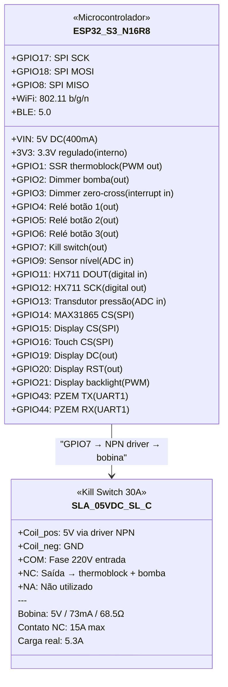
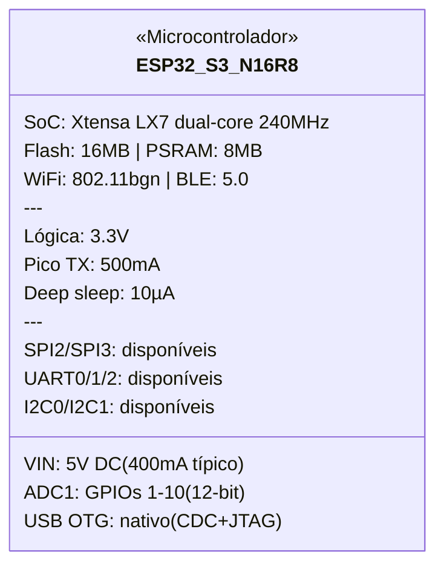
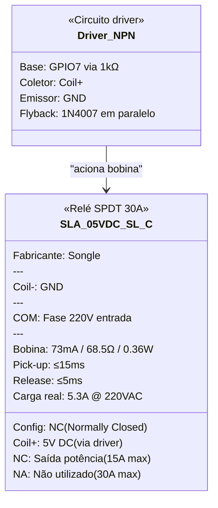
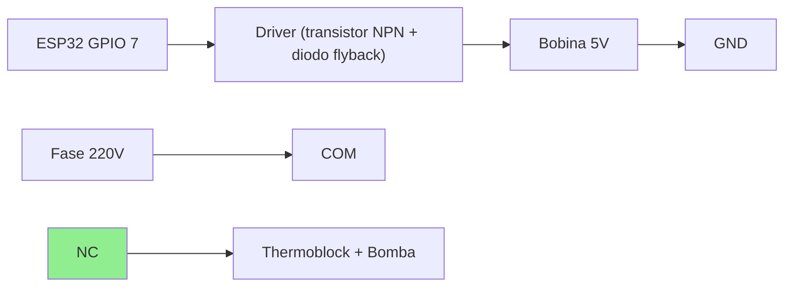

# Componentes — Especificações Detalhadas

Referência técnica de cada componente do projeto, com pinagem, consumo, protocolos e notas de integração.

## Visão geral (datasheet visual)



---

## 1. ESP32-S3-WROOM-1 N16R8

**Função:** Microcontrolador principal — coordena sensores, atuadores, display, WiFi e MQTT.

### Datasheet visual



### Especificações gerais

| Parâmetro | Valor |
|-----------|-------|
| SoC | ESP32-S3 (Xtensa LX7 dual-core @ 240 MHz) |
| Flash | 16 MB (Quad SPI) |
| PSRAM | 8 MB (Octal SPI) |
| WiFi | 802.11 b/g/n 2.4 GHz |
| Bluetooth | BLE 5.0 |
| GPIOs disponíveis | 45 (nem todos expostos no DevKit) |
| ADC | 2× SAR ADC, 20 canais, 12-bit |
| DAC | Não possui (usar PWM ou I2S) |
| SPI | 4 interfaces (SPI0/1 reservados para flash/PSRAM) |
| I2C | 2 interfaces |
| UART | 3 interfaces |
| USB | USB OTG nativo (CDC/JTAG) |
| Temperatura operação | -40°C a +85°C |

### Alimentação

| Parâmetro | Valor |
|-----------|-------|
| Tensão de entrada (pino VIN) | 5V DC (regulado internamente para 3.3V) |
| Tensão lógica (GPIOs) | 3.3V |
| Corrente média (WiFi ativo) | ~240 mA @ 3.3V |
| Corrente pico (TX WiFi) | ~500 mA |
| Corrente deep sleep | ~10 µA |
| Consumo total pelo 5V | ~400 mA (com margem) |

### Pinout relevante para o projeto

| GPIO | Função atribuída | Protocolo | Notas |
|------|-----------------|-----------|-------|
| 11 | HX711 DOUT | Digital in | — |
| 12 | HX711 SCK | Digital out | — |
| 13 | Transdutor pressão | ADC | 0-3.3V (divisor resistivo) |
| 14 | MAX31865 CS | SPI (CS) | — |
| 15 | Display CS | SPI (CS) | — |
| 16 | Touch CS (XPT2046) | SPI (CS) | — |
| 17 | SPI SCK | SPI | Compartilhado |
| 18 | SPI MOSI | SPI | Compartilhado |
| 8 | SPI MISO | SPI | Compartilhado |
| 19 | Display DC | Digital out | — |
| 20 | Display RST | Digital out | — |
| 43 | PZEM TX | UART1 TX | — |
| 44 | PZEM RX | UART1 RX | — |
| 1 | SSR (thermoblock) | Digital out | PWM para PID |
| 2 | Dimmer (bomba) | Digital out | Sincronizado com zero-cross |
| 3 | Dimmer ZC (zero-cross) | Digital in | Interrupt |
| 4 | Relé botão 1 | Digital out | — |
| 5 | Relé botão 2 | Digital out | — |
| 6 | Relé botão 3 | Digital out | — |
| 7 | Kill switch | Digital out | NC — LOW = normal, HIGH = corte |
| 9 | Sensor nível | ADC | Capacitivo, sinal analógico |
| 21 | Display backlight | PWM | — |

### Notas de integração

- DevKits comuns (ex: ESP32-S3-DevKitC-1) já incluem regulador 3.3V, USB-C e botões BOOT/RST
- GPIOs 0, 45, 46 têm restrições no boot — evitar para funções críticas
- Flash e PSRAM ocupam GPIOs 26-37 no N16R8 — **não usar esses pinos**
- ADC2 não funciona com WiFi ativo — usar apenas ADC1 (GPIOs 1-10)

---

## 2. SLA-05VDC-SL-C (Songle 30A)

**Função:** Kill switch de segurança — corte físico de emergência da potência AC (thermoblock + bomba).

### Datasheet visual



### Especificações gerais

| Parâmetro | Valor |
|-----------|-------|
| Fabricante | Songle |
| Modelo | SLA-05VDC-SL-C |
| Tipo de contato | SPDT (1 NA + 1 NF + 1 COM) |
| Configuração no projeto | **NF (Normally Closed)** — corta ao energizar |
| Corrente máxima (NA) | 30A @ 250VAC |
| Corrente máxima (NF) | 15A @ 250VAC |
| Tensão máxima | 250VAC / 30VDC |
| Carga do projeto | ~5.3A @ 220VAC (1170W) |
| Margem de segurança | ~3x no NF |

### Bobina (lado controle)

| Parâmetro | Valor |
|-----------|-------|
| Tensão nominal | 5V DC |
| Corrente da bobina | ~73 mA |
| Resistência da bobina | ~68.5Ω |
| Potência da bobina | ~0.36W |
| Tempo de atuação (pick-up) | ≤ 15 ms |
| Tempo de liberação | ≤ 5 ms |

### Pinagem física

```
         ┌─────────────────┐
         │   SLA-05VDC-SL-C │
         └─────────────────┘

Bobina (lado inferior):
  Pin 1: Coil (+)  ← 5V via driver
  Pin 2: Coil (-)  ← GND

Contatos (lado superior):
  COM:  Comum       ← Fase 220V (entrada)
  NC:   Norm. Closed ← Saída para thermoblock + bomba
  NA:   Norm. Open   ← Não utilizado
```

### Diagrama de ligação no projeto



### Lógica de operação

| Estado do GPIO | Bobina | Contato NC | Máquina |
|---------------|--------|-----------|---------|
| **LOW** (padrão) | Desenergizada | **Fechado** | ✅ Funcionando |
| **HIGH** (emergência) | Energizada | **Aberto** | ❌ Potência cortada |
| **ESP32 reiniciando** | Desenergizada | **Fechado** | ✅ Funcionando |
| **Falha total (sem 5V)** | Desenergizada | **Fechado** | ✅ Funcionando |

### Driver necessário

O ESP32 fornece ~12mA por GPIO, insuficiente para os 73mA da bobina. Necessário:

- **Transistor NPN** (ex: BC337, 2N2222) — saturação com base via resistor 1kΩ
- **Diodo flyback** (ex: 1N4007) — proteção contra back-EMF ao desligar a bobina
- Ou usar **módulo relé 1 canal com optoacoplador** (já inclui tudo)

### Notas de integração

- Operação NC garante que a máquina **não desliga** se o ESP32 reiniciar ou perder energia
- O kill switch **não é o controle funcional** — quem liga/desliga thermoblock e bomba são o SSR e o dimmer
- É apenas uma camada de segurança para corte de emergência (remoto ou por condição anômala)
- Considerar adicionar um LED indicador no case externo para sinalizar quando o kill switch está ativo (potência cortada)
