# Componentes — Especificações Detalhadas

Referência técnica de cada componente do projeto, com pinagem, consumo, protocolos e notas de integração.

## Visão geral (datasheet visual)

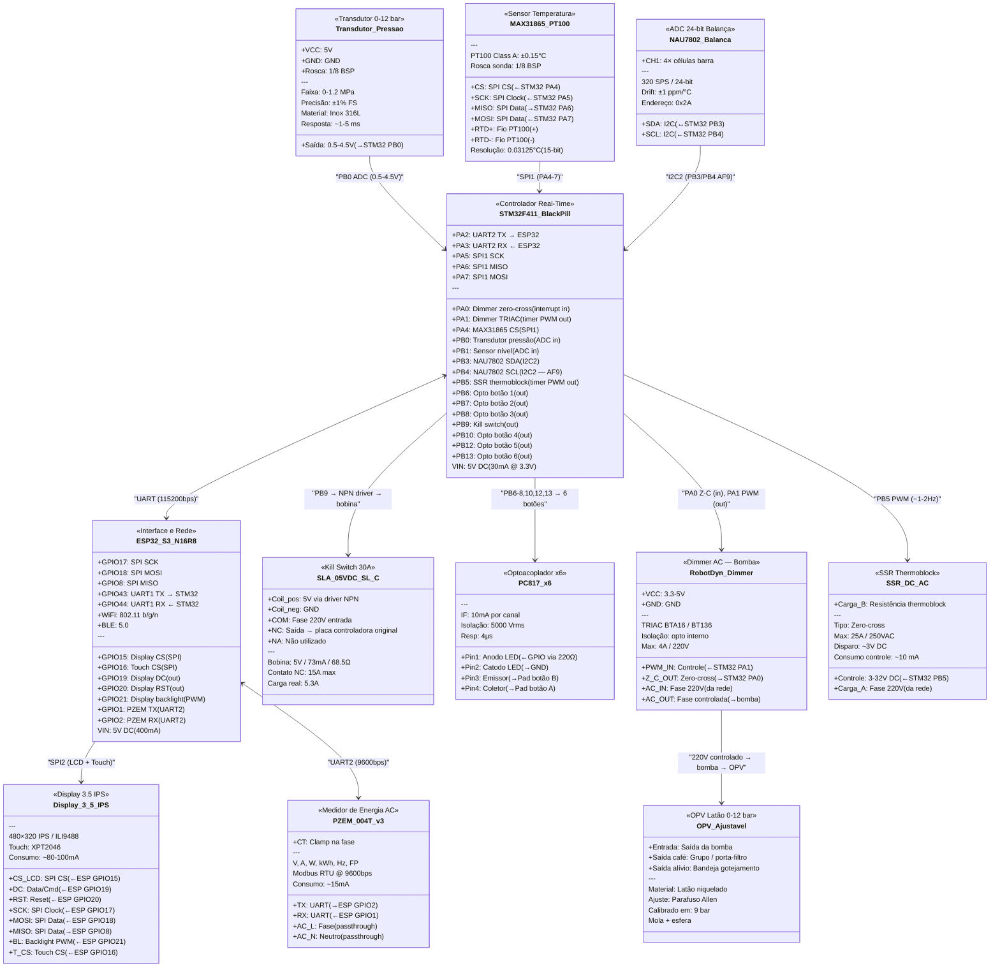

---

## 1. ESP32-S3-WROOM-1 N16R8

**Função:** Interface e comunicação — display LVGL, web server, API REST, MQTT, WebSocket, OTA. Recebe dados do STM32 via UART.

### Datasheet visual

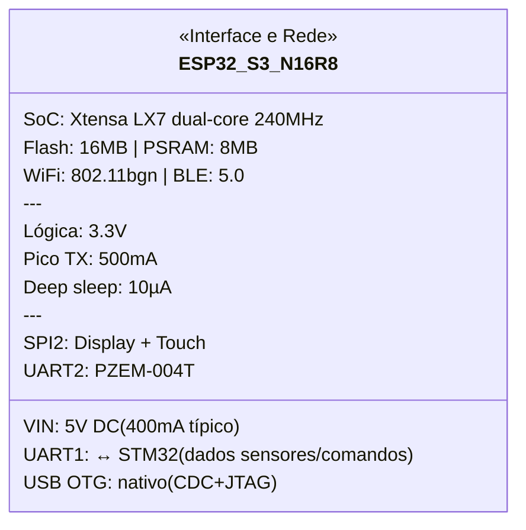

### Especificações gerais

| Parâmetro | Valor |
|-----------|-------|
| SoC | ESP32-S3 (Xtensa LX7 dual-core @ 240 MHz) |
| Flash | 16 MB (Quad SPI) |
| PSRAM | 8 MB (Octal SPI) |
| WiFi | 802.11 b/g/n 2.4 GHz |
| Bluetooth | BLE 5.0 |
| GPIOs disponíveis | 45 (nem todos expostos no DevKit) |
| ADC | 2× SAR ADC, 20 canais, 12-bit |
| DAC | Não possui (usar PWM ou I2S) |
| SPI | 4 interfaces (SPI0/1 reservados para flash/PSRAM) |
| I2C | 2 interfaces |
| UART | 3 interfaces |
| USB | USB OTG nativo (CDC/JTAG) |
| Temperatura operação | -40°C a +85°C |

### Alimentação

| Parâmetro | Valor |
|-----------|-------|
| Tensão de entrada (pino VIN) | 5V DC (regulado internamente para 3.3V) |
| Tensão lógica (GPIOs) | 3.3V |
| Corrente média (WiFi ativo) | ~240 mA @ 3.3V |
| Corrente pico (TX WiFi) | ~500 mA |
| Corrente deep sleep | ~10 µA |
| Consumo total pelo 5V | ~400 mA (com margem) |

### Pinout relevante para o projeto

| GPIO | Função atribuída | Protocolo | Notas |
|------|-----------------|-----------|-------|
| 15 | Display CS | SPI (CS) | — |
| 16 | Touch CS (XPT2046) | SPI (CS) | — |
| 17 | SPI SCK | SPI | Compartilhado display + touch |
| 18 | SPI MOSI | SPI | Compartilhado |
| 8 | SPI MISO | SPI | Compartilhado |
| 19 | Display DC | Digital out | — |
| 20 | Display RST | Digital out | — |
| 21 | Display backlight | PWM | — |
| 43 | STM32 TX (ESP→STM) | UART1 TX | Comandos e config |
| 44 | STM32 RX (STM→ESP) | UART1 RX | Dados de sensores |
| 1 | PZEM TX | UART2 TX | Medição de energia |
| 2 | PZEM RX | UART2 RX | — |

### Notas de integração

- DevKits comuns (ex: ESP32-S3-DevKitC-1) já incluem regulador 3.3V, USB-C e botões BOOT/RST
- GPIOs 0, 45, 46 têm restrições no boot — evitar para funções críticas
- Flash e PSRAM ocupam GPIOs 26-37 no N16R8 — **não usar esses pinos**
- ADC2 não funciona com WiFi ativo — usar apenas ADC1 (GPIOs 1-10)
- **Não controla sensores/atuadores diretamente** — toda leitura e atuação passa pelo STM32 via UART
- Se o ESP32 reiniciar, o STM32 continua operando a máquina de forma segura

---

## 2. STM32F411CEU6 (WeAct BlackPill v3)

**Função:** Controlador real-time — PID do thermoblock, dimmer da bomba, leitura de sensores (peso, pressão, temperatura, nível), acionamento de relés. Opera independente do ESP32.

### Datasheet visual

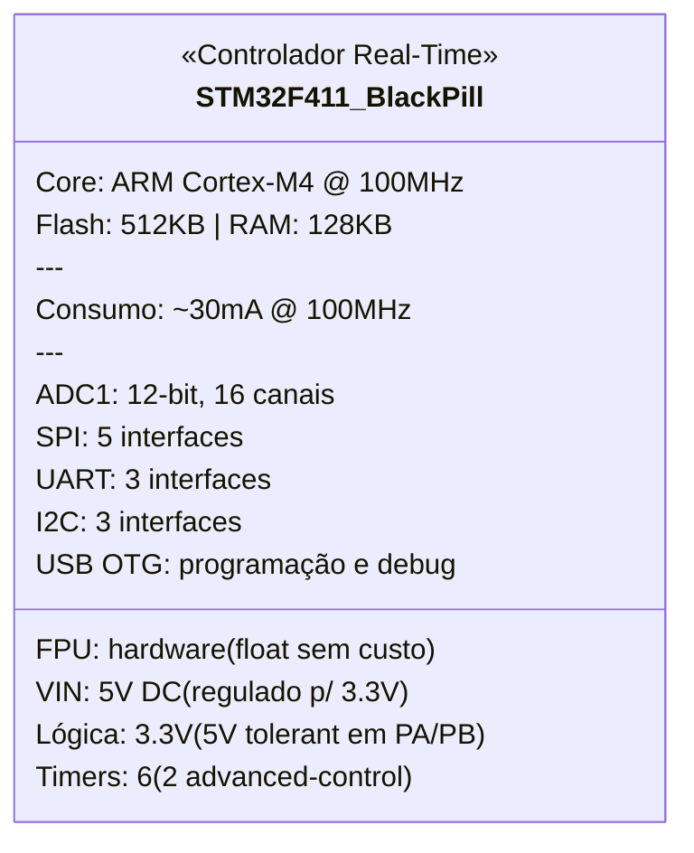

### Especificações gerais

| Parâmetro | Valor |
|-----------|-------|
| Core | ARM Cortex-M4F @ 100 MHz |
| FPU | Sim (single-precision hardware) |
| Flash | 512 KB |
| RAM | 128 KB |
| ADC | 1× 12-bit SAR, 16 canais, 2.4 MSPS |
| Timers | 6 (TIM1, TIM2-5, TIM9-11) |
| UART | 3 (USART1, USART2, USART6) |
| SPI | 5 (SPI1-5) |
| I2C | 3 |
| USB | OTG FS |
| GPIOs | 36 (no encapsulamento UFQFPN48) |
| Tensão de operação | 1.7V–3.6V |
| 5V tolerant | Sim (maioria dos pinos PA/PB) |
| Temperatura operação | -40°C a +85°C |
| Encapsulamento DevKit | BlackPill — 2×20 headers, USB-C |

### Alimentação

| Parâmetro | Valor |
|-----------|-------|
| Tensão de entrada (pino 5V) | 5V DC (regulado internamente para 3.3V) |
| Tensão lógica (GPIOs) | 3.3V |
| Corrente típica (100MHz, periféricos ativos) | ~30 mA @ 3.3V |
| Corrente com todos ADC + timers | ~50 mA @ 3.3V |
| Consumo total pelo 5V | ~60 mA (com margem) |

### Pinout relevante para o projeto

| Pino | Função atribuída | Protocolo | Notas |
|------|-----------------|-----------|-------|
| PA0 | Dimmer zero-cross | EXTI (interrupt in) | TIM2_CH1 disponível se precisar |
| PA1 | Dimmer TRIAC | Timer PWM out | TIM2_CH2 — disparo sincronizado |
| PA2 | UART2 TX → ESP32 | USART2 TX | Envia dados de sensores |
| PA3 | UART2 RX ← ESP32 | USART2 RX | Recebe comandos |
| PA4 | MAX31865 CS | SPI1 (CS) | NSS manual |
| PA5 | SPI1 SCK | SPI1 | Compartilhado MAX31865 |
| PA6 | SPI1 MISO | SPI1 | Compartilhado MAX31865 |
| PA7 | SPI1 MOSI | SPI1 | Compartilhado MAX31865 |
| PB0 | Transdutor pressão | ADC1_CH8 | 0-3.3V (divisor resistivo se necessário) |
| PB1 | Sensor nível | ADC1_CH9 | Capacitivo, sinal analógico |
| PB3 | NAU7802 SDA | I2C2 (AF9) | Balança — dados bidirecional |
| PB4 | NAU7802 SCL | I2C2 (AF9) | Balança — clock |
| PB5 | SSR thermoblock | Timer PWM out | TIM3_CH2 — PID slow PWM (~1-2Hz) |
| PB6 | Opto botão 1 | Digital out | Via resistor 220Ω → PC817 |
| PB7 | Opto botão 2 | Digital out | Via resistor 220Ω → PC817 |
| PB8 | Opto botão 3 | Digital out | Via resistor 220Ω → PC817 |
| PB9 | Kill switch | Digital out | NC — LOW = normal, HIGH = corte |
| PB10 | Opto botão 4 | Digital out | Via resistor 220Ω → PC817 |
| PB12 | Opto botão 5 | Digital out | Via resistor 220Ω → PC817 |
| PB13 | Opto botão 6 | Digital out | Via resistor 220Ω → PC817 |

**Pinos usados:** 20 de 36 disponíveis — **sobra confortável**

### Notas de integração

- **Opera independente** — se o ESP32 desligar/reiniciar, o STM32 mantém PID ativo e máquina segura
- **FPU hardware** — cálculos PID com float (Kp, Ki, Kd) sem penalidade de performance
- **Timers advanced** (TIM1) — pode ser usado futuramente para pressure profiling mais sofisticado
- **5V tolerant** — pode receber sinais de módulos 5V diretamente (relés) sem level shifter
- Comunicação com ESP32 via UART a **115200 bps** (suficiente para ~100 atualizações/s de todos os sensores)
- Protocolo sugerido: pacotes binários com header + checksum (tipo Modbus simplificado) ou MessagePack

### Responsabilidades (divisão STM32 ↔ ESP32)

| STM32 (real-time) | ESP32 (interface) |
|--------------------|-------------------|
| PID thermoblock (SSR) | Display LVGL |
| Dimmer bomba (zero-cross) | Web server + API REST |
| Leitura NAU7802 (peso) | MQTT publish |
| Leitura MAX31865 (temp) | WebSocket (gráficos live) |
| Leitura pressão (ADC) | OTA de ambos (self + STM32) |
| Leitura nível (ADC) | Histórico de shots |
| Acionamento relés (botões) | Beanconqueror BLE |
| Kill switch | PZEM-004T (energia) |
| Lógica de segurança (timeout, over-temp) | Configurações e perfis |

---

## 3. SLA-05VDC-SL-C (Songle 30A)

**Função:** Kill switch de segurança — corte da alimentação AC da **placa controladora original** da cafeteira. Ao desenergizar a placa, thermoblock, bomba e válvulas param. O disjuntor geral (botão físico na lateral da máquina) permanece como corte total.

### Datasheet visual

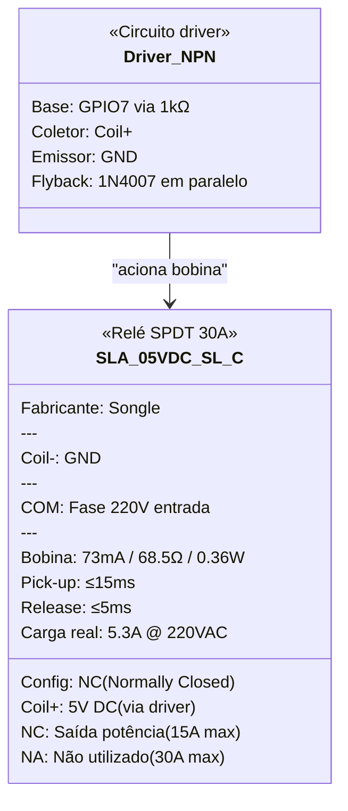

### Especificações gerais

| Parâmetro | Valor |
|-----------|-------|
| Fabricante | Songle |
| Modelo | SLA-05VDC-SL-C |
| Tipo de contato | SPDT (1 NA + 1 NF + 1 COM) |
| Configuração no projeto | **NF (Normally Closed)** — corta ao energizar |
| Corrente máxima (NA) | 30A @ 250VAC |
| Corrente máxima (NF) | 15A @ 250VAC |
| Tensão máxima | 250VAC / 30VDC |
| Carga do projeto | ~5.3A @ 220VAC (1170W) |
| Margem de segurança | ~3x no NF |

### Bobina (lado controle)

| Parâmetro | Valor |
|-----------|-------|
| Tensão nominal | 5V DC |
| Corrente da bobina | ~73 mA |
| Resistência da bobina | ~68.5Ω |
| Potência da bobina | ~0.36W |
| Tempo de atuação (pick-up) | ≤ 15 ms |
| Tempo de liberação | ≤ 5 ms |

### Pinagem física

```
         ┌─────────────────┐
         │   SLA-05VDC-SL-C │
         └─────────────────┘

Bobina (lado inferior):
  Pin 1: Coil (+)  ← 5V via driver
  Pin 2: Coil (-)  ← GND

Contatos (lado superior):
  COM:  Comum       ← Fase 220V (entrada)
  NC:   Norm. Closed ← Saída para thermoblock + bomba
  NA:   Norm. Open   ← Não utilizado
```

### Diagrama de ligação no projeto

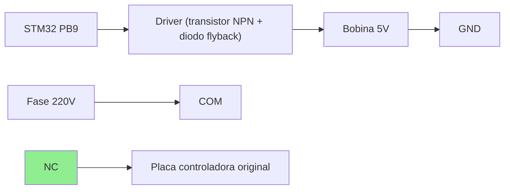

### Lógica de operação

| Estado do GPIO | Bobina | Contato NC | Placa original | ESP32 + STM32 |
|---------------|--------|-----------|----------------|---------------|
| **LOW** (padrão) | Desenergizada | **Fechado** | ✅ Energizada | ✅ Online |
| **HIGH** (emergência) | Energizada | **Aberto** | ❌ Sem energia | ✅ Online |
| **STM32 reiniciando** | Desenergizada | **Fechado** | ✅ Energizada | ✅ Online |
| **Falha total (sem 5V)** | Desenergizada | **Fechado** | ✅ Energizada | ❌ Offline |
| **Disjuntor lateral OFF** | — | — | ❌ Tudo desligado | ❌ Tudo desligado |

### Driver necessário

O STM32 fornece ~25mA por GPIO, insuficiente para os 73mA da bobina. Necessário:

- **Transistor NPN** (ex: BC337, 2N2222) — saturação com base via resistor 1kΩ
- **Diodo flyback** (ex: 1N4007) — proteção contra back-EMF ao desligar a bobina
- Ou usar **módulo relé 1 canal com optoacoplador** (já inclui tudo)

### Notas de integração

- Operação NC garante que a placa original **não desliga** se o STM32 reiniciar ou perder energia
- O kill switch corta a **placa controladora original** da cafeteira — sem ela, thermoblock, bomba e válvulas ficam inoperantes
- **Não é o controle funcional** — quem liga/desliga thermoblock e bomba no dia-a-dia são o SSR e o dimmer
- É uma camada de segurança para corte de emergência (remoto ou por condição anômala detectada pelo STM32)
- ESP32 + STM32 permanecem online (alimentados pela fonte DC separada) — podem reportar o evento e religar remotamente
- O **disjuntor geral** (botão físico na lateral da cafeteira) continua como corte total de tudo
- Considerar adicionar um LED indicador no case externo para sinalizar quando o kill switch está ativo (placa original sem energia)

---

## 4. PC817 — Optoacoplador (×6)

**Função:** Simular acionamento dos 6 botões do painel da máquina (clique simples e press-and-hold) via STM32, em paralelo com os botões físicos.

### Datasheet visual

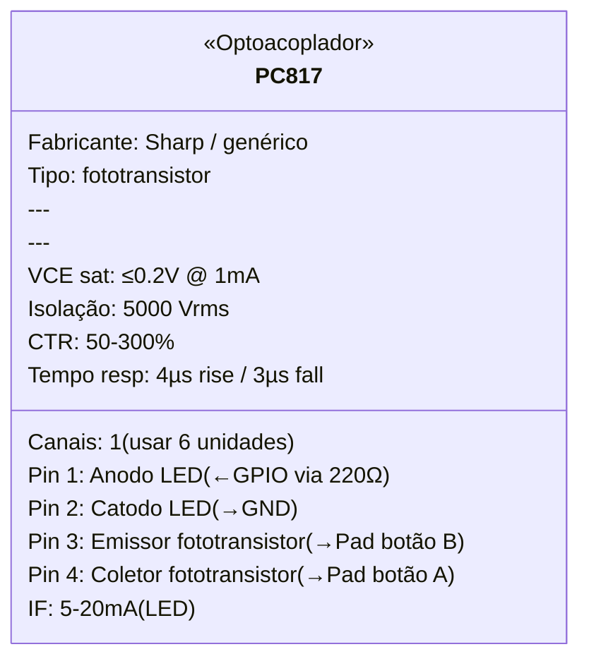

### Especificações gerais

| Parâmetro | Valor |
|-----------|-------|
| Fabricante | Sharp (original) / genéricos compatíveis |
| Encapsulamento | DIP-4 |
| Tipo | Fototransistor |
| Canais | 1 por unidade (6 unidades no projeto) |
| Tensão de isolação | 5000 Vrms |
| CTR (Current Transfer Ratio) | 50–300% @ IF=5mA, VCE=5V |
| Tempo de resposta | ~4µs (rise) / ~3µs (fall) |
| Temperatura de operação | -30°C a +100°C |

### Lado de entrada (LED infravermelho — pinos 1 e 2)

| Parâmetro | Valor |
|-----------|-------|
| Tensão direta (VF) | ~1.2V @ IF=20mA |
| Corrente direta (IF) | 5–20 mA (recomendado) |
| Corrente máxima (IF max) | 50 mA |
| Resistor limitador | **220Ω** (para 3.3V e ~10mA) |
| Cálculo | (3.3V − 1.2V) / 10mA = 210Ω → **220Ω padrão** |

### Lado de saída (fototransistor — pinos 3 e 4)

| Parâmetro | Valor |
|-----------|-------|
| VCE saturação | ≤ 0.2V @ IC=1mA |
| Corrente coletor máx (IC) | 50 mA |
| Uso no projeto | Fecha o circuito entre os 2 pads do botão |

### Pinagem física

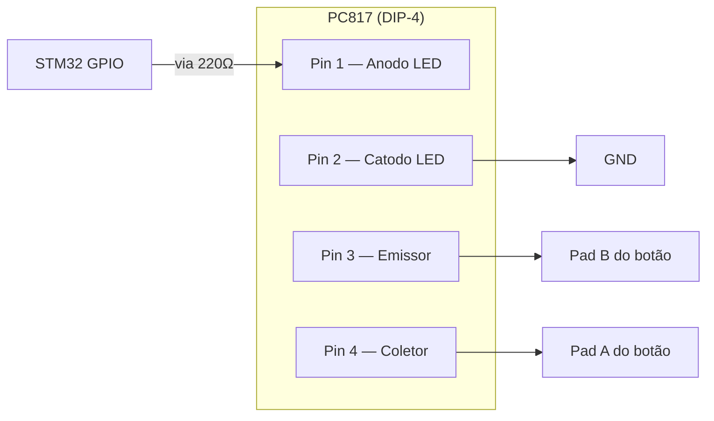

### Mapeamento dos 6 botões

| # | Botão | GPIO STM32 | 1 clique | 2 cliques | Hold / clique+hold |
|---|-------|-----------|----------|-----------|---------------------|
| 1 | Expresso | PB6 | Café curto | Café lungo | Calibra curto / Calibra lungo |
| 2 | Al Gusto | PB7 | Inicia extração livre | Para a extração | — |
| 3 | Latte | PB8 | Café curto (com leite) | Café lungo (com leite) | Calibra curto / Calibra lungo |
| 4 | Cappuccino | PB10 | Café curto (com espuma) | Café lungo (com espuma) | Calibra curto / Calibra lungo |
| 5 | Espuma | PB12 | Inicia vaporização do leite | Para a vaporização | — |
| 6 | Limpeza | PB13 | Ciclo de limpeza (15bar, 120°C, timer fixo) | — | — |

### Lógica de acionamento

Os botões da Prima Latte têm 3 modos de interação:

| Ação | Comportamento | STM32 simula |
|------|--------------|--------------|
| **1 clique** | Extração curta (volume pré-definido) | Pulso `HIGH` ~150ms |
| **2 cliques** | Extração lungo (volume pré-definido) | 2 pulsos de ~150ms |
| **Clicar e segurar** | Calibrar volume do curto (para ao soltar) | `HIGH` sustentado → `LOW` ao soltar |
| **1 clique + segurar no 2º** | Calibrar volume do lungo (para ao soltar) | Pulso ~150ms + pausa + `HIGH` sustentado → `LOW` |

> **Nota:** No uso via IoT, a calibração por hold provavelmente não será utilizada — o STM32 controla parada por peso (ratio), tempo ou comando do usuário via Al Gusto. Mas o optoacoplador suporta hold sem problemas (estado sólido, sem desgaste).

| Estado GPIO | Significado |
|-------------|-------------|
| `LOW` | Inativo (botão "solto") |
| `HIGH` por ~150ms | Clique simples |
| `HIGH` sustentado | Botão "pressionado" (calibração) |

### Consumo

| Cenário | Corrente total (6 unidades) |
|---------|----------------------------|
| Todos inativos | 0 mA |
| 1 botão ativo | ~10 mA |
| Pior caso (todos ativos) | ~60 mA |
| **Operação típica** | **~10 mA** (1 botão por vez) |

### Notas de integração

- Soldado **em paralelo** com cada botão físico — os botões originais continuam funcionando
- **Isolação galvânica total** entre STM32 e placa da máquina (5000 Vrms)
- Resposta de ~4µs é ordens de grandeza mais rápida que o debounce de qualquer botão mecânico
- Sem desgaste mecânico (estado sólido) — vida útil essencialmente infinita
- Sem ruído audível (ao contrário de relés)
- Cada PC817 precisa de 1 resistor de 220Ω (total: 6 resistores)
- Se a placa interna usar lógica invertida (pull-up), o fototransistor funciona igualmente — só fecha o contato

---

## 5. Display TFT 3.5" IPS — ILI9488 + XPT2046

**Função:** Interface visual e tátil para controle local da máquina — gráficos de extração em tempo real, temperatura, pressão, controles de perfil e status. Renderizado via LVGL no ESP32-S3.

### Datasheet visual

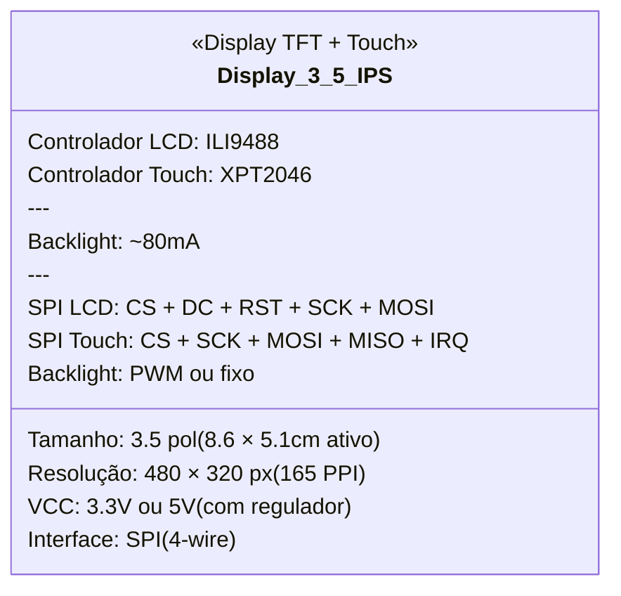

### Dimensões do painel frontal da cafeteira

O painel frontal da Oster Prima Latte II mede **12 × 9 cm**. Considerando uma borda de ~1 cm para encaixe/moldura, a área útil para o display é de aproximadamente **10 × 7 cm** — comporta com folga o módulo 3.5" (93 × 59 mm).

### Especificações gerais

| Parâmetro | Valor |
|-----------|-------|
| Tamanho | 3.5 polegadas |
| Tipo de painel | IPS (ângulo de visão ~170°) |
| Resolução | 480 × 320 pixels |
| PPI | ~165 |
| Profundidade de cor | 262K (RGB666) / 16.7M (RGB888) |
| Controlador LCD | ILI9488 |
| Controlador touch | XPT2046 (resistivo) ou GT911 (capacitivo) |
| Interface | SPI (4-wire), até 80MHz |
| Área ativa | ~86 × 51 mm |
| Dimensão total do módulo | ~93 × 59 mm |
| Ângulo de visão | ~170° (IPS) |

### Alimentação

| Parâmetro | Valor |
|-----------|-------|
| Tensão de entrada | 3.3V ou 5V (módulos comuns têm regulador onboard) |
| Corrente LCD | ~20 mA |
| Corrente backlight | ~60-80 mA (depende do brilho) |
| Consumo total | **~80-100 mA** |

### Pinagem (conexão com ESP32-S3)

| Pino do módulo | GPIO ESP32 | Função | Notas |
|----------------|-----------|--------|-------|
| CS (LCD) | GPIO15 | SPI Chip Select LCD | — |
| DC / RS | GPIO19 | Data/Command select | — |
| RST | GPIO20 | Reset LCD | — |
| SCK | GPIO17 | SPI Clock | Compartilhado com touch |
| MOSI / SDA | GPIO18 | SPI Master Out | Compartilhado com touch |
| MISO | GPIO8 | SPI Master In | Compartilhado (usado pelo touch) |
| LED / BL | GPIO21 | Backlight (PWM) | Dimmer por software |
| T_CS | GPIO16 | SPI Chip Select touch | — |
| T_IRQ | — | Touch interrupt | Opcional (pode usar polling) |
| VCC | 3.3V | Alimentação | — |
| GND | GND | — | — |

**Total: 8 GPIOs do ESP32** (CS, DC, RST, SCK, MOSI, MISO, BL, T_CS)

### Diagrama de ligação

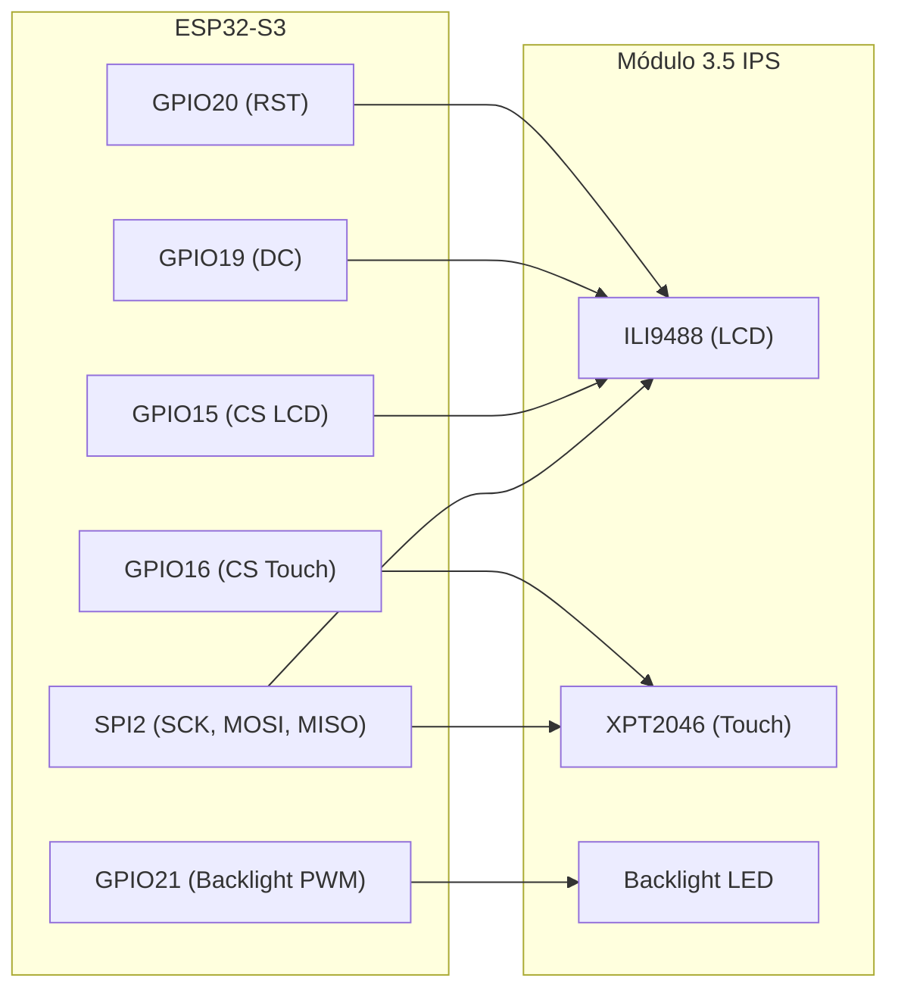

### Notas de integração

- SPI compartilhado entre LCD e touch — alternado via Chip Select (CS)
- Clock SPI recomendado: **40MHz para LCD**, **2.5MHz para touch** (XPT2046 é mais lento)
- LVGL configurado com buffer de ~480×40 linhas (~38KB) — cabe no PSRAM
- Backlight via PWM permite ajuste de brilho (economia de energia, conforto visual)
- IPS garante ângulo de visão amplo — legível de qualquer posição na bancada
- Módulos de 3.5" são facilmente encontrados no AliExpress/Amazon por R$30-60
- Se quiser upgrade futuro para capacitivo, existem módulos 3.5" com GT911 (drop-in, mesma interface SPI)
- Resolução 480×320 é suficiente para LVGL com gráficos de extração, gauges e botões touch

---

## 6. PZEM-004T v3.0 — Medidor de energia AC

**Quantidade:** 1

**Função:** Monitorar consumo de energia da cafeteira em tempo real — tensão, corrente, potência ativa, energia acumulada, frequência e fator de potência. Instalado na **entrada AC**, antes do relé kill switch, para medir o consumo total do sistema (incluindo a própria eletrônica IoT).

### Datasheet visual

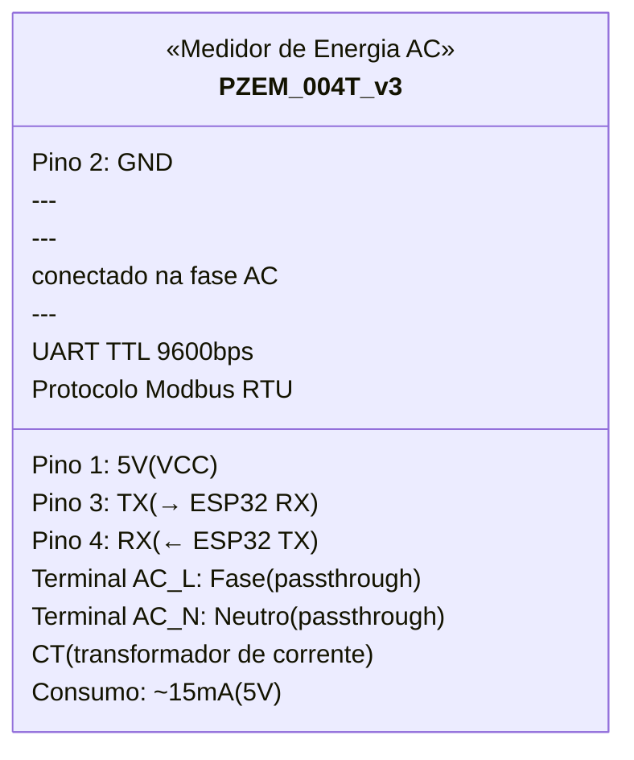

### Especificações gerais

| Parâmetro | Valor |
|-----------|-------|
| Modelo | PZEM-004T v3.0 |
| Medições | Tensão, Corrente, Potência, Energia, Frequência, Fator de Potência |
| Faixa de tensão | 80–260V AC |
| Faixa de corrente | 0–100A (via CT externo) |
| Precisão de tensão | ±0.5% |
| Precisão de corrente | ±0.5% |
| Resolução de energia | 0.001 kWh |
| Interface | UART TTL (Modbus RTU) |
| Baud rate | 9600 bps (fixo) |
| Endereço Modbus | 0x01 (padrão, configurável 0x01–0xF7) |
| Reset de energia | Via comando Modbus |

### Alimentação

| Parâmetro | Valor |
|-----------|-------|
| Tensão de alimentação | 5V DC (pelo conector TTL) |
| Consumo | ~15 mA |

> ⚠️ **NÃO alimentar com 3.3V** — o módulo exige 5V. Os pinos TX/RX são 3.3V compatíveis.

### Pinagem (conexão com ESP32-S3)

| Pino PZEM | GPIO ESP32 | Função | Notas |
|-----------|-----------|--------|-------|
| VCC (5V) | — | Alimentação | Direto do barramento 5V |
| GND | GND | Referência | Comum com ESP32 |
| TX | GPIO2 | UART2 RX | PZEM TX → ESP32 RX |
| RX | GPIO1 | UART2 TX | ESP32 TX → PZEM RX |

### CT (Transformador de corrente)

O PZEM-004T v3 utiliza um **CT (Current Transformer) externo** tipo clamp que envolve o fio de **fase AC**:

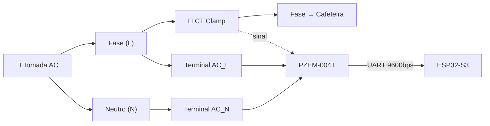

> O CT é **não-invasivo** — não precisa cortar o fio. Basta abrir o clamp e envolver a fase.

### Posição no circuito


O PZEM fica **antes do relé kill switch**, na entrada AC. Isso garante que:
- Mede o consumo **total** (placa original + eletrônica IoT + perdas)
- Continua medindo mesmo com kill switch ativo (placa original desligada)
- Detecta se a cafeteira está realmente desligada (potência ≈ 0W com kill switch ativo)

### Métricas disponíveis via MQTT

| Métrica | Tópico MQTT | Taxa de leitura |
|---------|-------------|-----------------|
| Tensão (V) | `espresso/oster6701/energy/voltage` | 0.5 Hz |
| Corrente (A) | `espresso/oster6701/energy/current` | 0.5 Hz |
| Potência (W) | `espresso/oster6701/energy/power` | 0.5 Hz |
| Energia (kWh) | `espresso/oster6701/energy/energy` | 0.5 Hz |
| Frequência (Hz) | `espresso/oster6701/energy/frequency` | 0.5 Hz |
| Fator de potência | `espresso/oster6701/energy/pf` | 0.5 Hz |

### Notas de integração

- Comunicação UART a 9600bps — **não** usar o mesmo barramento UART do STM32 (115200bps)
- Biblioteca recomendada: `mandulaj/PZEM-004T-v30` (Arduino/PlatformIO)
- O CT clamp acompanha o módulo (geralmente até 100A, mais que suficiente para ~1200W da cafeteira)
- O módulo armazena energia acumulada (kWh) em memória não-volátil — sobrevive a resets
- Para resetar o contador de energia: enviar comando Modbus específico via software
- Leitura a cada 2s (0.5 Hz) é suficiente — o PZEM atualiza internamente a ~1Hz
- Compatível com 3.3V nos pinos lógicos apesar de alimentação 5V

---

## 7. NAU7802 + 4× Células de carga barra 500g — Balança de extração

**Quantidade:** 1× NAU7802 (breakout SparkFun Qwiic ou genérico) + 4× células de carga tipo barra (beam) 500g

**Função:** Medir peso do café extraído em tempo real para parada preditiva por ratio (ex: 1:2 → 18g dose = para em ~36g). As 4 células ficam nos cantos da base, montadas em degraus laterais, ligadas em ponte de Wheatstone, alimentando um único NAU7802 via I2C.

**Por que barra e não botão?** A base fica na zona de respingos de café. Células barra permitem montagem elevada nos cantos, com a plataforma de pesagem selada por cima e espaço livre embaixo para drenagem — mantendo as células secas.

### Datasheet visual

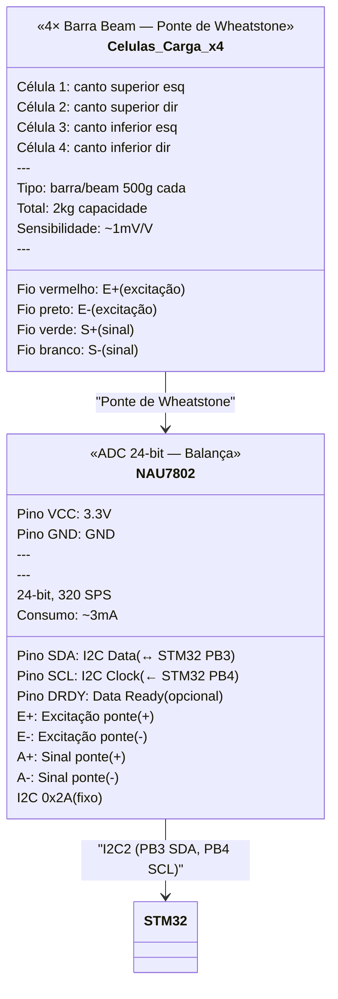

### Disposição das células na base

```mermaid
flowchart TB
    subgraph BASE["Plataforma de pesagem (~10×8 cm)"]
        direction TB
        subgraph TOP[""]
            C1["⚖️ Barra 1\n(canto esq)"] ~~~ C2["⚖️ Barra 2\n(canto dir)"]
        end
        subgraph MID["Plataforma selada (sem furos)\nÁrea central livre para drenagem"]
            GRADE["Grade inox customizada"]
        end
        subgraph BOT[""]
            C3["⚖️ Barra 3\n(canto esq)"] ~~~ C4["⚖️ Barra 4\n(canto dir)"]
        end
    end
    
    BASE --> NAU["NAU7802"]
    NAU -->|I2C| STM["STM32"]
    STM -->|"peso > target → para"| OPTO["Opto Al Gusto"]
```

> Com 4 barras nos cantos, a leitura é precisa independente da posição — 1 xícara centralizada ou 2 xícaras lado a lado.

### Montagem e proteção contra líquidos

A base da xícara fica na zona de respingos/escorrimento de café. As células **devem ficar protegidas**:

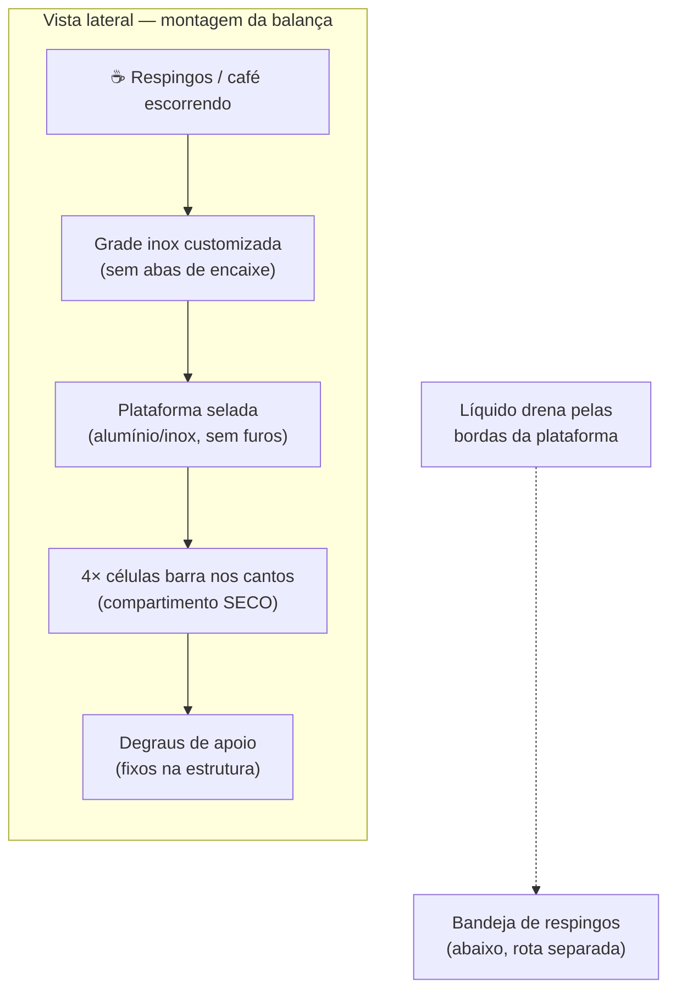

| Elemento | Descrição |
|----------|-----------|
| **Grade inox** | Customizada (corte a laser ou CNC), sem abas que encaixem no plástico — folga ~1-2mm nas bordas |
| **Plataforma selada** | Alumínio ou inox fino (~1-2mm), sem furos — líquido escorre pelas bordas |
| **Células nos degraus** | 1 barra em cada canto, apoiada em degraus moldados/impressos, **fora da zona de líquido** |
| **Vedação** | O-ring ou silicone entre plataforma e estrutura de suporte |
| **Drenagem** | Líquido cai ao redor da plataforma para bandeja original |

> **Regra fundamental:** 100% da força peso (grade + xícara + café) deve passar pelas células. A grade NÃO pode tocar na estrutura plástica da máquina — qualquer contato cria bypass de força e invalida a leitura.

### Especificações do NAU7802

| Parâmetro | Valor |
|-----------|-------|
| Resolução | 24-bit |
| Taxa de amostragem | 10 / 20 / 40 / 80 / **320 SPS** |
| Interface | I2C (endereço fixo 0x2A) |
| Ganho programável (PGA) | 1× / 2× / 4× / 8× / 16× / 32× / 64× / **128×** |
| Tensão de excitação | Interna (AVDD) ou externa |
| Ruído RMS | ~20 nV (ganho 128×, 10 SPS) |
| Drift térmico | **~±1 ppm/°C** (6× melhor que HX711) |
| Consumo | ~3 mA |
| Tensão operação | 2.7V – 5.5V |
| Encapsulamento | SOP-16 (breakout disponível) |

### Especificações das células de carga

| Parâmetro | Valor |
|-----------|-------|
| Tipo | **Barra / beam** (flexão) |
| Formato | Retangular compacto (~30-50mm × 12mm) |
| Capacidade individual | 500g |
| Capacidade total (4× em ponte) | **2 kg** |
| Sensibilidade | ~1 mV/V |
| Sobrecarga segura | 150% (750g por célula) |
| Material | Liga de alumínio |
| Erro combinado | ±0.05% FS |
| Compensação térmica | 0–50°C |
| Fiação | 4 fios (ponte completa interna) |

### Resolução prática

| Configuração | Resolução |
|---|---|
| 320 SPS, ganho 128× | ~0.02-0.03g |
| 80 SPS, ganho 128× | ~0.01-0.02g |
| 10 SPS, ganho 128× | ~0.005g |

Para extração de espresso, **320 SPS com ~0.03g** é ideal — prioriza velocidade de leitura para a parada preditiva.

### Alimentação

| Parâmetro | Valor |
|-----------|-------|
| Tensão | 3.3V (direto do barramento, sem regulador) |
| Consumo NAU7802 | ~3 mA |
| Excitação das células | Via AVDD interno do NAU7802 |
| Consumo total (ADC + células) | **~3 mA** |

### Pinagem (conexão com STM32)

| Pino NAU7802 | Pino STM32 | Função | Notas |
|---|---|---|---|
| VCC | 3.3V | Alimentação | — |
| GND | GND | Referência | — |
| SDA | PB3 | I2C2 Data | AF9 (remap), pull-up 4.7kΩ |
| SCL | PB4 | I2C2 Clock | AF9 (remap), pull-up 4.7kΩ |
| DRDY | — | Data Ready | Opcional (pode usar polling) |
| E+ | — | Excitação ponte (+) | Saída interna AVDD |
| E- | — | Excitação ponte (-) | GND interno |
| A+ (CH1+) | — | Sinal ponte (+) | Fio verde das células |
| A- (CH1-) | — | Sinal ponte (-) | Fio branco das células |

### Ligação da ponte de Wheatstone

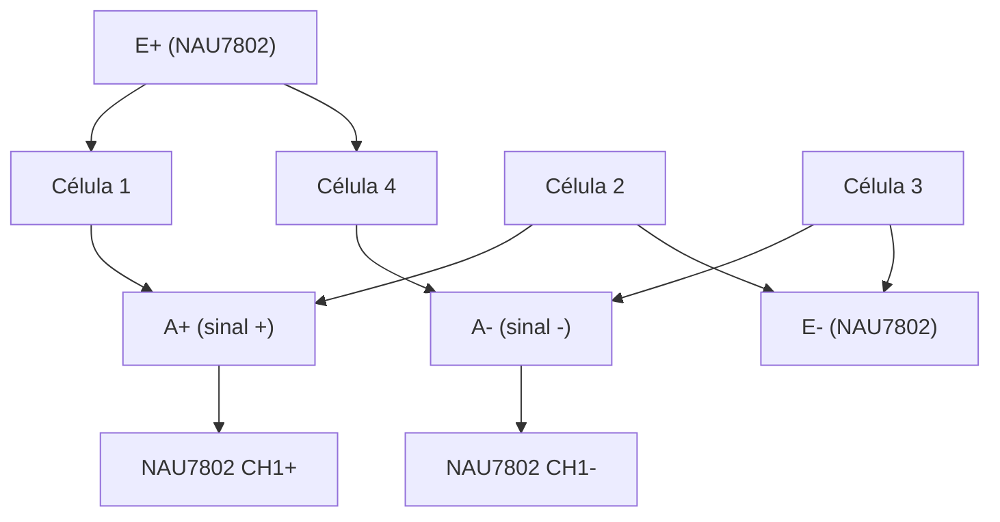

> As 4 células se ligam em ponte — **não precisa de 4 ADCs**. Uma ponte de Wheatstone soma os sinais e entrega um diferencial único ao NAU7802.

### Parada preditiva

O STM32 implementa o algoritmo de parada preditiva:

1. **Tara automática** antes de cada extração (peso atual = zero)
2. **Amostragem a 320 SPS** (~3ms por leitura) durante a extração
3. **Cálculo de fluxo instantâneo**: `Δpeso / Δtempo` (média móvel de ~10 leituras)
4. **Modelo de inércia**: estima quanto líquido ainda vai cair após corte (~1-3g dependendo da pressão e flow rate)
5. **Corte antecipado**: para em `(target - inércia_estimada)`
6. **Aprendizado**: compara peso final real vs target e ajusta modelo para próxima extração

| Parâmetro | Valor típico |
|---|---|
| Precisão de leitura | ~0.03g |
| Margem de erro no corte | **±0.5g (~0.5ml)** |
| Latência sensor → decisão | ~3-6 ms |
| Latência total (até bomba parar) | ~500-1300 ms (mecânica) |

### Notas de integração

- **I2C2 via AF9 (remap)**: PB3/PB4 no STM32F411 não são os pinos padrão do I2C2 (PB10/PB3) — requer configuração de alternate function AF9 no CubeMX/HAL
- **Pull-ups de 4.7kΩ** em SDA e SCL — o breakout SparkFun já inclui, mas verificar
- Endereço I2C fixo **0x2A** — sem conflito com outros dispositivos no barramento
- Biblioteca recomendada: `sparkfun/SparkFun_Qwiic_Scale_NAU7802` (Arduino/PlatformIO)
- **Calibração**: fazer uma vez com peso conhecido (ex: 200g), salvar fator na flash do STM32
- **Tara**: recalculada automaticamente a cada extração (drift térmico compensado)
- A plataforma de pesagem deve ser **mecanicamente isolada** do corpo da máquina para evitar vibração da bomba nos readings — considerar amortecedores de silicone nos apoios
- Com 320 SPS, usar **filtro digital** (média móvel ou Kalman) para suavizar ruído de vibração

---

## 8. RobotDyn AC Dimmer Module

**Função:** Controle de tensão AC da bomba vibratória Ulka via phase-angle cutting (TRIAC). Permite controle contínuo de pressão de 0 a 100% — usado para pré-infusão a pressão reduzida e pressure profiling.

### Datasheet visual

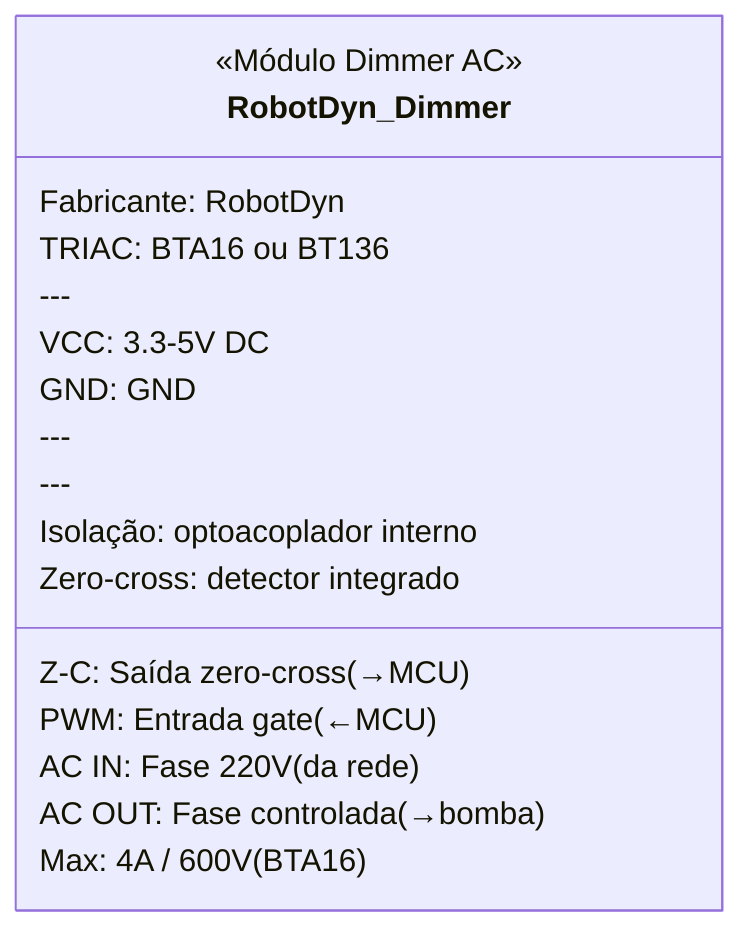

### Especificações gerais

| Parâmetro | Valor |
|-----------|-------|
| TRIAC | BTA16 (600V/16A) ou BT136 (600V/4A) |
| Corrente máxima | 4A contínuo (suficiente para Ulka: ~0.8A) |
| Tensão AC | 110-600V (compatível com 220V BR) |
| Tensão de controle | 3.3V–5V DC |
| Detecção zero-cross | Integrada (optoacoplador) |
| Isolação | Opto interno (AC ↔ DC separados) |
| Método de controle | Phase-angle cutting |
| Consumo lado DC | ~5 mA (lógica + LED opto) |

### Princípio de operação — Phase-angle cutting

O módulo corta cada semi-ciclo da onda AC em um ponto específico, reduzindo a tensão RMS entregue à bomba:

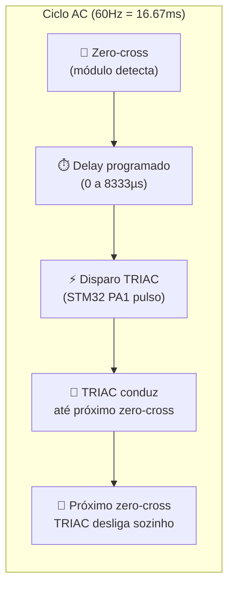

| Delay após zero-cross | Tensão efetiva | Pressão aprox. | Uso |
|---|---|---|---|
| ~0 µs | ~100% (220V RMS) | ~9 bar (limitado OPV) | Extração normal |
| ~2000 µs | ~85% | ~7-8 bar | Extração suave |
| ~4000 µs | ~60% | ~5-6 bar | Pré-infusão média |
| ~6000 µs | ~35% | ~3-4 bar | Pré-infusão leve |
| ~8333 µs (½ ciclo) | ~0% | 0 bar | Bomba desligada |

> A relação delay→pressão **não é linear** — depende da curva do TRIAC e da carga. O STM32 faz uma calibração inicial (sweep 0-100%) para construir um lookup table `delay↔pressão`.

### Controle em malha fechada

O dimmer opera integrado ao transdutor de pressão:

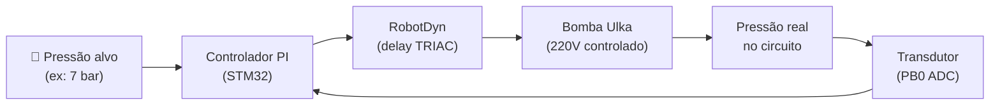

1. STM32 recebe setpoint de pressão (ex: 7 bar para pré-infusão)
2. Lê pressão real via transdutor (ADC PB0, 50-100 Hz)
3. Calcula erro → ajusta delay do TRIAC via PI
4. Converge em <1s após calibração inicial

### Pinagem (conexão com STM32)

| Pino módulo | Pino STM32 | Função | Notas |
|---|---|---|---|
| VCC | 3.3V | Alimentação lógica | — |
| GND | GND | Referência | — |
| Z-C (zero-cross) | **PA0** | Interrupt (EXTI) | Pulso a cada zero-cross (~120Hz em 60Hz) |
| PWM (gate TRIAC) | **PA1** | Timer PWM out | TIM2_CH2 — pulso de disparo sincronizado |

### Conexão lado AC

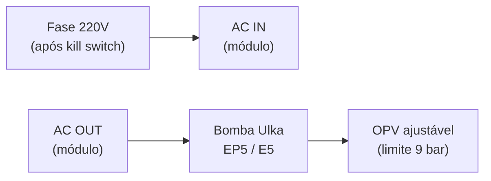

> O neutro da bomba vai direto — o dimmer controla apenas a **fase**.

### Notas de integração

- **PA0 (zero-cross)**: configurar como EXTI (interrupt on rising edge) — cada pulso dispara o timer de delay
- **PA1 (TRIAC gate)**: TIM2_CH2 em one-pulse mode — gera pulso de ~10µs após o delay calculado
- Frequência de controle: **120 vezes por segundo** (2× por ciclo AC de 60Hz) — resolução de ~70µs por step
- O TRIAC desliga sozinho no zero-cross — não precisa de sinal de desligamento
- **Não usar SSR+PWM** para bomba vibratória — causa pulsação mecânica (liga 100%, desliga, liga 100%)
- A bomba Ulka EP5/E5 consome ~0.8A — bem dentro dos 4A do módulo
- Usar **snubber RC** (100Ω + 100nF) nos terminais AC se houver ruído EMI perceptível
- Posicionar o módulo no **case externo** (próximo ao ESP32/STM32), com cabos AC via conector de aviação

---

## 9. Transdutor de pressão 0-1.2 MPa

**Função:** Medir pressão no circuito hidráulico da cafeteira em tempo real. Permite controle em malha fechada (dimmer + transdutor), calibração do OPV, e logging de curvas de pressão durante a extração.

### Datasheet visual

```mermaid
classDiagram
    class Transdutor_Pressao {
        <<Transdutor Piezo-Resistivo>>
        Faixa: 0 a 1.2 MPa (12 bar)
        Saída: 0.5-4.5V (ratiometric)
        ---
        VCC: 5V DC
        GND: GND
        SIGNAL: 0.5-4.5V (→divisor→ADC)
        ---
        Rosca: 1/8 BSP macho
        Material: Inox 316L
        Vedação: O-ring integrado
        ---
        Precisão: ±1% FS (~±0.12 bar)
        Resposta: 1-5 ms
        Sobrepressão: 2× (24 bar)
    }
```

### Especificações gerais

| Parâmetro | Valor |
|-----------|-------|
| Faixa de medição | 0–1.2 MPa (0–12 bar) |
| Saída | 0.5–4.5V (proporcional linear) |
| Alimentação | 5V DC |
| Corrente | ~10 mA |
| Precisão | ±1% FS (~±0.12 bar) |
| Repetibilidade | ±0.5% FS (~±0.06 bar) |
| Tempo de resposta | 1–5 ms |
| Temperatura operação | -40°C a +85°C |
| Sobrepressão | 2× (24 bar) |
| Burst pressure | 3× (36 bar) |
| Rosca | 1/8" BSP macho |
| Material (wetted) | Aço inox 316L |
| Vedação | O-ring Viton |
| Cabo | 3 fios (VCC, GND, SIGNAL) |

### Conversão de saída

| Pressão | Tensão de saída | Após divisor (→ADC) |
|---|---|---|
| 0 bar | 0.5V | 0.37V |
| 3 bar | 1.5V | 1.10V |
| 6 bar | 2.5V | 1.83V |
| 9 bar | 3.5V | 2.57V |
| 12 bar | 4.5V | 3.30V |

Fórmula: `pressão (bar) = (tensão - 0.5) × 12 / 4.0`

### Divisor resistivo (4.5V → 3.3V)

O ADC do STM32 aceita máximo 3.3V. A saída do transdutor vai até 4.5V — necessário divisor:

```mermaid
flowchart LR
    TRANS_OUT["Transdutor\n(0.5-4.5V)"] --> R1["R1 = 3.3kΩ"]
    R1 --> PONTO["Ponto de medição\n(0.37-3.30V)"]
    PONTO --> R2["R2 = 10kΩ"]
    R2 --> GND_R["GND"]
    PONTO --> ADC["STM32 PB0\n(ADC1_CH8)"]
```

| Parâmetro | Valor |
|---|---|
| R1 | 3.3 kΩ (1%) |
| R2 | 10 kΩ (1%) |
| Razão | Vout = Vin × 10 / 13.3 = **0.752×** |
| Entrada máx | 4.5V → 3.38V (dentro do limite 3.3V + margem) |
| Impedância vista pelo ADC | ~2.5 kΩ (ok para SAR ADC do STM32) |

> Adicionar capacitor cerâmico de **100nF** no ponto de medição para filtrar ruído da bomba.

### Posicionamento no circuito hidráulico

```mermaid
flowchart LR
    BOMBA["Bomba Ulka"] --> TEE["T latão\n1/8 BSP"]
    TEE --> GRUPO["→ Grupo / porta-filtro"]
    TEE --> TRANS2["↑ Transdutor\nde pressão"]
    TEE --> PT100["↑ PT100\n(sonda com rosca)"]
```

O transdutor é instalado em um **T de latão 1/8" BSP** na saída da bomba (após o OPV), compartilhando o ponto de medição com a sonda PT100.

### Pinagem (conexão com STM32)

| Fio transdutor | Destino | Notas |
|---|---|---|
| VCC (vermelho) | 5V DC | Alimentação |
| GND (preto) | GND | Referência |
| SIGNAL (amarelo) | Divisor R1/R2 → **PB0** | ADC1_CH8, 12-bit |

### Notas de integração

- Leitura ADC a **50-100 Hz** — suficiente para controle em malha fechada e logging de curvas
- O STM32 usa a leitura para:
  - **Controle do dimmer** — ajusta TRIAC para atingir pressão-alvo
  - **Calibração do OPV** — verificar se o ajuste mecânico está em 9 bar
  - **Curvas de extração** — envia dados via UART ao ESP32 para gráficos/histórico
  - **Alarme de sobrepressão** — se transdutor ler >10 bar, aciona kill switch
- **Calibração**: 0 bar = torneira aberta (sem bomba), verificar se lê ~0.5V antes do divisor
- Preferir transdutor com **conector DIN** ou **cabo com terminal** — evitar solda em ambiente úmido
- A rosca 1/8" BSP é padrão em bombas Ulka e conexões de espresso — compatível sem adaptador

---

## 10. OPV ajustável — Latão

**Função:** Válvula mecânica de alívio de sobrepressão. Limita a pressão máxima do circuito a **9 bar** (ajustável), desviando o excesso de volta para a bandeja de gotejamento. Atua como teto de segurança passivo — funciona mesmo sem eletrônica.

### Datasheet visual

```mermaid
classDiagram
    class OPV_Ajustavel {
        <<Válvula de Alívio>>
        Material: Latão niquelado (food grade)
        Faixa: 0-12 bar (ajustável)
        ---
        Entrada: 1/8 BSP fêmea (da bomba)
        Saída café: 1/8 BSP fêmea (→grupo)
        Saída alívio: Mangueira (~4mm)
        ---
        Ajuste: Parafuso Allen (2.5mm)
        Mecanismo: Mola + esfera inox
        Calibrado em: 9 bar
        Vedação: O-ring EPDM
    }
```

### Especificações gerais

| Parâmetro | Valor |
|-----------|-------|
| Material corpo | Latão niquelado (food grade) |
| Material esfera | Aço inoxidável |
| Material mola | Aço inox (tratamento térmico) |
| Vedação | O-ring EPDM |
| Rosca entrada | 1/8" BSP fêmea |
| Rosca saída café | 1/8" BSP fêmea |
| Saída alívio | Espigão ~4mm (para mangueira de silicone) |
| Faixa de ajuste | ~0–12 bar |
| Ajuste calibrado | **9 bar** |
| Ferramenta de ajuste | Chave Allen 2.5mm |
| Temperatura máxima | 150°C |

### Mecanismo interno

```mermaid
flowchart TB
    subgraph OPV["Corte transversal do OPV"]
        direction TB
        PARAFUSO["🔩 Parafuso Allen\n(gira = muda pressão)"] --> MOLA["🔄 Mola de compressão\n(mais apertada = mais pressão)"]
        MOLA --> ESFERA["⚫ Esfera inox\n(veda a passagem)"]
        ESFERA --> SEDE["Sede cônica\n(onde a esfera encosta)"]
    end
    
    ENTRADA["Água da bomba\n(pressão variável)"] --> SEDE
    SEDE -->|"P < 9 bar"| SAIDA_CAFE["→ 100% vai pro grupo\n(café)"]
    SEDE -->|"P ≥ 9 bar"| SAIDA_ALIVIO["→ Excesso desvia\npara bandeja"]
```

| Rotação do parafuso | Efeito na mola | Resultado |
|---|---|---|
| Apertar (horário) | Comprime mais | Pressão de abertura **sobe** |
| Afrouxar (anti-horário) | Relaxa | Pressão de abertura **desce** |

### Posicionamento no circuito hidráulico

```mermaid
flowchart LR
    RESERV["Reservatório\nde água"] --> BOMBA3["Bomba Ulka\n(via dimmer)"]
    BOMBA3 --> OPV3["OPV\n(9 bar)"]
    OPV3 -->|"P < 9 bar\n(100% do fluxo)"| TEE2["T latão\n1/8 BSP"]
    OPV3 -->|"P ≥ 9 bar\n(excesso)"| BANDEJA["Bandeja de\ngotejamento"]
    TEE2 --> GRUPO2["Grupo →\nporta-filtro"]
    TEE2 --> TRANS3["Transdutor\npressão"]
    TEE2 --> PT100_2["PT100\nsonda"]
```

> O OPV fica **entre a bomba e o T de medição**. Assim, o transdutor sempre lê a pressão real entregue ao grupo (já limitada pelo OPV).

### Drenagem — por que bandeja e não reservatório

O OPV fica na parte inferior da cafeteira. A água aliviada não tem pressão suficiente para subir de volta ao reservatório (que fica acima). A solução é drenar para a **bandeja de gotejamento**:

| Opção | Funciona? | Por quê |
|---|---|---|
| Retorno ao reservatório | ❌ | OPV está embaixo, reservatório está em cima — água não sobe sem pressão |
| Bandeja de gotejamento | ✅ | Está abaixo ou ao nível do OPV — gravidade faz o trabalho |

Usar mangueira de silicone food-grade (~4mm interno) do espigão de alívio até a bandeja.

### Procedimento de calibração

1. Instalar **porta-filtro cego** (blind basket) — bloqueia a saída, forçando pressão máxima
2. Ligar bomba a **100%** (dimmer = delay 0)
3. Ler pressão no transdutor (STM32 → UART → ESP32 → display)
4. Ajustar parafuso Allen **enquanto a bomba está rodando**:
   - Leitura >9 bar → afrouxar (anti-horário)
   - Leitura <9 bar → apertar (horário)
5. Confirmar que estabiliza em **9.0 ±0.2 bar**
6. Desligar bomba, conferir que não há vazamento

> Após calibrado, o OPV **não precisa de ajuste novamente** — a menos que a mola degrade (anos de uso).

### Notas de integração

- OPV é **puramente mecânico** — não consome energia, não tem fios, não conecta ao STM32
- É a **última linha de defesa**: mesmo se o dimmer falhar em 100%, o OPV limita a pressão
- Substituir o OPV original da cafeteira (geralmente plástico, calibrado em ~15-19 bar de fábrica)
- **Não usar fita veda-rosca em excesso** — rosca BSP com o-ring já veda; excesso de teflon pode travar o ajuste
- O ajuste pode ser feito em passos de ~¼ de volta — cada volta completa muda ~3-4 bar tipicamente
- Manter acessível para re-calibração futura (não selar dentro da máquina)

---

## 11. SSR DC→AC (Solid State Relay)

**Função:** Controle do thermoblock (resistência de aquecimento) via PID. Chaveamento zero-cross — liga e desliga a resistência em ciclos AC completos, sem cortar a onda. O STM32 modula o duty cycle (~1-2Hz) para manter a temperatura alvo.

### Datasheet visual

```mermaid
classDiagram
    class SSR_DC_AC {
        <<Solid State Relay>>
        Tipo: DC → AC (zero-cross)
        ---
        Controle+: 3-32V DC (←STM32 PB5)
        Controle-: GND
        ---
        Carga A: Fase 220V (da rede)
        Carga B: Resistência thermoblock
        ---
        Max: 25A / 250VAC
        Disparo: ~3V DC / ~10mA
        Zero-cross: integrado
        Queda interna: ~1.5V
    }
```

### Especificações gerais

| Parâmetro | Valor |
|-----------|-------|
| Tipo | DC control → AC load (zero-cross) |
| Tensão de controle | 3–32V DC |
| Corrente de controle | ~7.5–25 mA (depende do modelo) |
| Tensão de carga | 24–380V AC |
| Corrente máxima de carga | 25A (modelos comuns: 10A, 25A, 40A) |
| Carga do projeto | Resistência thermoblock (~5A @ 220V, ~1100W) |
| Margem de segurança | ~5× (25A / 5A) |
| Queda de tensão interna | ~1.2–1.6V |
| Zero-cross switching | Sim (integrado) |
| Tempo de resposta | < 1 ciclo AC (~16.7ms) |
| Dissipação @ 5A | ~7.5W (necessário dissipador) |
| Isolação | > 2500V RMS (opto interno) |
| Temperatura operação | -40°C a +80°C |

### Por que zero-cross (e não phase-angle como o dimmer)

| Aspecto | Phase-angle (TRIAC/Dimmer) | Zero-cross (SSR) |
|---|---|---|
| Corta a onda no meio? | Sim — reduz tensão RMS | Não — ciclos inteiros |
| EMI gerado | Alto (harmônicos) | Mínimo |
| Necessário para bomba? | ✅ Sim — precisa de tensão variável | ❌ Não |
| Necessário para resistência? | ❌ Não | ✅ Sim — só on/off basta |
| Controle | Contínuo (0-100% por ciclo) | Duty cycle (% de ciclos ligados) |

A resistência é uma carga **puramente resistiva** — não precisa de tensão variável. A massa térmica do thermoblock faz a média: 60% de ciclos ligados = 60% da potência média = temperatura estável.

### Controle PID — slow PWM

```mermaid
flowchart LR
    SETPOINT["🎯 Temperatura alvo\n(ex: 93°C)"] --> PID_T["PID + Feedforward\n(STM32 FPU)"]
    PID_T --> SSR2["SSR\n(duty 0-100%)"]
    SSR2 --> RESIST["Resistência\nthermoblock"]
    RESIST --> AGUA["Água aquecida"]
    AGUA --> PT100_3["PT100\n(sonda 1/8 BSP)"]
    PT100_3 --> MAX["MAX31865\n(SPI → STM32)"]
    MAX --> PID_T
    
    BOMBA_FF["Bomba ON/OFF\n(feedforward)"] -.-> PID_T
```

| Parâmetro do PID | Valor típico | Notas |
|---|---|---|
| Frequência do loop | 1-2 Hz | Limitado pela inércia térmica |
| Duty cycle | 0-100% (em % de ciclos AC) | 50% = ligado 500ms, desligado 500ms |
| Feedforward | +20-30% duty quando bomba liga | Antecipa queda de temperatura |
| Overshoot alvo | < 1°C | Com PID bem tunado |
| Estabilidade alvo | ±0.5°C em regime | Sem surfing térmico |

### Dissipação térmica

O SSR dissipa ~1.5V × corrente de carga:

| Carga | Dissipação | Dissipador? |
|---|---|---|
| 5A (thermoblock) | ~7.5W | ✅ Necessário (alumínio ~50×50mm) |
| 10A (margem) | ~15W | Necessário maior |

> Usar **pasta térmica** entre SSR e dissipador. Posicionar no case externo com ventilação.

### Pinagem (conexão com STM32)

| Pino SSR | Destino | Notas |
|---|---|---|
| Controle (+) | **PB5** (via resistor 220Ω) | TIM3_CH2 — slow PWM ~1-2Hz |
| Controle (-) | GND | — |
| Carga A | Fase 220V (da rede) | Após kill switch |
| Carga B | Resistência thermoblock | — |

### Notas de integração

- **PB5 (TIM3_CH2)**: configurar timer com período de ~500ms-1s, duty variável de 0-100%
- O SSR **não precisa de driver** — 3.3V do STM32 já é suficiente para disparar (threshold ~3V, funciona na prática)
- Se quiser margem: resistor de 220Ω em série com PB5 → limita corrente a ~15mA (dentro do que o GPIO fornece)
- **Dissipador obrigatório** — SSR sem dissipador a 5A atinge >100°C rapidamente
- Preferir modelos com **base metálica** (Fotek, Omron G3MB, Crydom) — facilita fixação no dissipador
- O neutro da resistência vai direto — SSR chavia apenas a **fase**
- Considerar **fusível rápido de 10A** em série com a carga como proteção adicional
- O kill switch (relé NC) atua **antes** do SSR na cadeia — se acionado, SSR fica sem fase

---

## 12. MAX31865 + PT100 sonda com rosca

**Função:** Medição precisa de temperatura da água na saída do thermoblock. O MAX31865 converte a resistência do PT100 (RTD) em leitura digital de 15-bit via SPI. Alimenta o PID de temperatura que controla o SSR.

### Datasheet visual

```mermaid
classDiagram
    class MAX31865 {
        <<Conversor RTD Digital>>
        Fabricante: Maxim / Analog Devices
        Resolução: 15-bit (0.03125°C)
        ---
        CS: SPI Chip Select (←STM32 PA4)
        SCK: SPI Clock (←STM32 PA5)
        MISO: SPI Data out (→STM32 PA6)
        MOSI: SPI Data in (←STM32 PA7)
        DRDY: Data Ready (opcional)
        ---
        RTD+: Fio PT100 (+)
        RTD-: Fio PT100 (-)
        REF+: Resistor referência
        REF-: Resistor referência
        ---
        VCC: 3.3V
        Consumo: ~3 mA
    }

    class PT100_Sonda {
        <<RTD Classe A — Sonda>>
        Tipo: Pt100 (100Ω @ 0°C)
        Classe: A (±0.15°C @ 0°C)
        ---
        Formato: Sonda curta com rosca
        Rosca: 1/8 BSP macho
        Bainha: Aço inox 316L
        Comprimento: 15-30mm
        ---
        Faixa: -50 a 250°C
        Coeficiente: α = 0.00385 Ω/Ω/°C
        Fiação: 3 fios (compensação)
    }

    MAX31865 --> PT100_Sonda : "2 ou 3 fios RTD"
```

### Especificações do MAX31865

| Parâmetro | Valor |
|-----------|-------|
| Fabricante | Maxim Integrated / Analog Devices |
| Resolução ADC | 15-bit |
| Resolução de temperatura | 0.03125°C |
| Interface | SPI (modo 1 ou 3, até 5 MHz) |
| Tensão de operação | 3.0–3.6V |
| Corrente típica | ~3 mA |
| Configuração RTD | 2, 3 ou 4 fios |
| Resistor de referência | 430Ω (para PT100) — incluso no breakout |
| Detecção de falha | Curto, circuito aberto, over/under range |
| Filtragem | 50Hz ou 60Hz (configurável) |
| Taxa de conversão | ~21 conversões/s (filtro 60Hz) |
| Encapsulamento | TSSOP-20 (breakout Adafruit / genérico) |

### Especificações do PT100 sonda com rosca

| Parâmetro | Valor |
|-----------|-------|
| Tipo | Pt100 (platina, 100Ω @ 0°C) |
| Classe | A (IEC 60751) |
| Precisão | ±0.15°C @ 0°C, ±0.35°C @ 100°C |
| Coeficiente α | 0.00385 Ω/Ω/°C |
| Formato | **Sonda curta (stub) com rosca** |
| Rosca | 1/8" BSP macho |
| Material bainha | Aço inox 316L |
| Comprimento da sonda | 15–30 mm |
| Diâmetro | ~3–6 mm |
| Fiação | **3 fios** (compensação de resistência do cabo) |
| Faixa útil | -50°C a +250°C |
| Tempo de resposta (em água) | ~1–3s (com bainha) |
| Vedação | O-ring Viton na rosca |

### Por que sonda com rosca (e não filme fino colado)

| Critério | Sonda com rosca | Filme colado na superfície |
|---|---|---|
| Mede temperatura | **Da água** (direta) | Do metal (indireta) |
| Delay térmico | ~1-3s (contato direto) | ~3-5s (condução metal→sensor) |
| Precisão do PID | ✅ Melhor | Pior (delay adicional) |
| Instalação | Rosqueia no T de latão | Cola com pasta térmica |
| Risco de vazamento | Baixo (com o-ring) | Zero |
| Padronização | Mesma rosca do transdutor (1/8" BSP) | — |

### Posicionamento

A sonda PT100 compartilha o **T de latão 1/8" BSP** com o transdutor de pressão, na saída do thermoblock:

```mermaid
flowchart LR
    THERMO["Thermoblock\n(saída)"] --> OPV4["OPV\n(9 bar)"] --> TEE3["T latão\n1/8 BSP"]
    TEE3 --> GRUPO3["→ Grupo"]
    TEE3 --> TRANS4["↑ Transdutor pressão"]
    TEE3 --> PT100_4["↑ PT100 sonda"]
```

> Ambos os sensores medem no **mesmo ponto** — pressão e temperatura da água que vai para o grupo. Rosca 1/8" BSP padrão — sem adaptadores.

### Pinagem (conexão com STM32)

| Pino MAX31865 | Pino STM32 | Função | Notas |
|---|---|---|---|
| VCC | 3.3V | Alimentação | — |
| GND | GND | Referência | — |
| CS | **PA4** | SPI1 Chip Select | NSS manual (GPIO) |
| SCK | **PA5** | SPI1 Clock | — |
| MISO (SDO) | **PA6** | SPI1 Data out | — |
| MOSI (SDI) | **PA7** | SPI1 Data in | — |
| DRDY | — | Data Ready | Opcional — pode usar polling |

### Ligação do PT100 (3 fios)

```mermaid
flowchart LR
    PT["PT100\n(3 fios)"] -->|"Fio 1 (vermelho)"| RTDP["RTD+ (MAX31865)"]
    PT -->|"Fio 2 (vermelho)"| RREF["FORCE+ (compensação)"]
    PT -->|"Fio 3 (branco)"| RTDN["RTD- (MAX31865)"]
```

A configuração de 3 fios compensa a resistência dos cabos:
- 2 fios vermelhos: um para medição, outro para compensação (mesma resistência de cabo se anula)
- 1 fio branco: retorno

> No breakout Adafruit MAX31865, **soldar o jumper de 3 fios** (vem configurado para 4 fios de fábrica).

### Configuração do filtro

| Frequência da rede | Configuração | Taxa de conversão |
|---|---|---|
| 50 Hz (Europa, etc.) | Filtro 50Hz | ~16.6 conversões/s |
| **60 Hz (Brasil)** | **Filtro 60Hz** | **~20 conversões/s** |

> Configurar para **60Hz** no registro de configuração do MAX31865 — rejeita ruído da rede elétrica brasileira.

### Notas de integração

- **SPI1** compartilhado: apenas o MAX31865 usa SPI1 no STM32 atualmente — CS (PA4) como GPIO manual
- Taxa de leitura: **~10-20 Hz** é suficiente para PID de temperatura (inércia térmica do thermoblock é de segundos)
- O MAX31865 detecta **falhas automaticamente** (circuito aberto, curto) — ler o registro de falhas e acionar alarme
- Breakout recomendado: **Adafruit MAX31865** (inclui resistor de referência 430Ω, capacitores, terminal para PT100)
- Biblioteca: `Adafruit_MAX31865` (Arduino/PlatformIO) — compatível com STM32 via SPI HAL
- **Calibração**: o MAX31865 + PT100 Class A vem calibrado de fábrica — não precisa de calibração manual
- A leitura de temperatura alimenta:
  - **PID do thermoblock** — controle primário
  - **Feedforward** — aumenta duty quando bomba liga (água fria entrando)
  - **Display** — temperatura em tempo real
  - **MQTT** — logging e gráficos de extração
  - **Alarme over-temp** — se >100°C, desliga SSR + aciona kill switch

---

## Validação do sistema

### Balanço energético (barramento 5V — fonte HLK-PM05)

| Componente | Consumo 5V | Notas |
|---|---|---|
| ESP32-S3 N16R8 | ~400 mA | WiFi + LVGL + WebSocket |
| STM32F411 BlackPill | ~60 mA | 100MHz + periféricos |
| Kill switch (bobina via driver) | ~73 mA | Só quando ativado (emergência) |
| 6× PC817 (optoacopladores) | ~10 mA | Típico: 1 botão por vez (~60mA pior caso) |
| NAU7802 | ~3 mA | ADC 24-bit balança |
| MAX31865 | ~3 mA | Conversor RTD (SPI) |
| PT100 (excitação) | ~1 mA | Via MAX31865 interno |
| Transdutor de pressão | ~10 mA | 0-1.2 MPa, alimentação 5V |
| Sensor nível | ~10 mA | Capacitivo, sinal analógico |
| RobotDyn Dimmer (lógica DC) | ~5 mA | Opto interno + zero-cross |
| SSR (controle DC) | ~15 mA | Corrente de disparo do opto interno |
| Display TFT 3.5" IPS | ~100 mA | ILI9488 + backlight |
| PZEM-004T v3 | ~15 mA | Medição de energia AC |
| **TOTAL (pior caso)** | **~755 mA** | — |
| **TOTAL (operação típica)** | **~622 mA** | Kill switch inativo, 1 opto |

### ⚠️ Fonte de alimentação

Com a inclusão de todos os módulos, o consumo de pior caso é **~755mA**.

| Fonte | Capacidade | Status |
|---|---|---|
| HLK-PM05 | 600 mA | ❌ Insuficiente (pior caso 755mA) |
| **HLK-5M05** | **1000 mA** | ✅ Recomendada (margem de ~32%) |
| HLK-10M05 | 2000 mA | Overkill mas segura |

A **HLK-5M05 (5V/1A)** continua sendo a escolha recomendada — com margem confortável.

### Balanço de pinos

| Controlador | Pinos usados | Pinos disponíveis | Margem |
|---|---|---|---|
| ESP32-S3 | 12 | ~25 usáveis | ✅ 13 livres |
| STM32F411 | 20 | 36 | ✅ 16 livres |

### Comunicação entre controladores

| Parâmetro | Valor |
|---|---|
| Interface | UART (ESP32 UART1 ↔ STM32 USART2) |
| Baud rate | 115200 bps |
| Nível lógico | 3.3V (ambos — sem level shifter) |
| Direção | Bidirecional |
| STM32 → ESP32 | Dados de sensores (peso, temp, pressão, nível, estado) |
| ESP32 → STM32 | Comandos (setpoint PID, iniciar extração, perfil dimmer, kill) |

