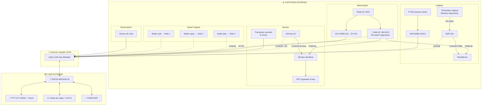

# Arquitetura do Sistema

## Visão Geral

O sistema é dividido em dois domínios físicos conectados por um conector de aviação:

1. **Domínio interno (dentro da máquina)**: sensores, atuadores de potência, fonte DC
2. **Domínio externo (case)**: ESP32, display, balança, medidor de energia

## Diagrama de Blocos Detalhado

## Sinais no Conector de Aviação

O conector GX16 (8 pinos) ou GX20 pode não ser suficiente. Considerar usar dois conectores ou um com mais pinos.

### Sinais Necessários

| Pino | Sinal | Direção | Descrição |
|---|---|---|---|
| 1 | VCC 5V | Interno → Externo | Alimentação DC da fonte HLK-PM05 |
| 2 | GND | Comum | Terra/referência |
| 3 | PT100_A | Interno → Externo | Fio A do PT100 (SPI via MAX31865) |
| 4 | PT100_B | Interno → Externo | Fio B do PT100 |
| 5 | PRESSAO | Interno → Externo | Sinal analógico do transdutor |
| 6 | NIVEL | Interno → Externo | Sinal do sensor de nível |
| 7 | SSR_CTRL | Externo → Interno | Controle do SSR (PID) |
| 8 | DIMMER_CTRL | Externo → Interno | Controle do dimmer (bomba) |
| 9 | DIMMER_ZC | Interno → Externo | Zero-crossing do dimmer |
| 10 | RELE_1 | Externo → Interno | Controle relé botão café |
| 11 | RELE_2 | Externo → Interno | Controle relé botão vapor |
| 12 | RELE_3 | Externo → Interno | Controle relé botão leite |
| 13 | KILL_SW | Externo → Interno | Controle relé kill switch (segurança — corte de potência AC) |
| 14 | AC_L | Passthrough | Fase AC (para PZEM no case) |
| 15 | AC_N | Passthrough | Neutro AC (para PZEM no case) |

> **Total**: 15 sinais → usar conector **GX20-15** (15 pinos) ou dois conectores GX16-8.

### Alternativa: SSR/Dimmer/Relés dentro da máquina
Se os módulos de potência ficarem **dentro** da máquina, o conector precisa apenas de sinais de baixa tensão (controle), reduzindo para ~10 pinos e cabendo em um GX16-10.

## Fluxo de uma Extração

```mermaid
stateDiagram-v2
    [*] --> Posicionar: Usuário posiciona xícara
    Posicionar --> TaraOK: Tara automática

    TaraOK --> SelecionarPerfil: Seleciona perfil\n(ex: Espresso 18g, ratio 1:2)
    SelecionarPerfil --> Verificacao: Pressiona "Iniciar"

    state Verificacao {
        [*] --> CheckTemp: Temperatura OK?
        CheckTemp --> CheckNivel: ✓
        CheckNivel --> CheckXicara: Nível de água OK? ✓
        CheckXicara --> [*]: Xícara detectada? ✓
    }

    Verificacao --> PreInfusao

    state PreInfusao {
        [*] --> BombaLow: Dimmer a ~30% (~3 bar)
        BombaLow --> Aguarda: Aguarda 5s
        Aguarda --> [*]
    }

    PreInfusao --> Extracao

    state Extracao {
        [*] --> BombaFull: Dimmer a 100% (9 bar via OPV)
        BombaFull --> MonitoraPeso: Monitora peso (10Hz)
        MonitoraPeso --> MonitoraPeso: peso < alvo
        MonitoraPeso --> PesoOK: peso ≥ alvo (36g)\nou tempo limite
    }

    Extracao --> Resultado: Desliga bomba

    state Resultado {
        [*] --> ExibeDisplay: 36.2g em 28s — ratio 1:2.01
        ExibeDisplay --> SalvaHistorico: Salva dados + curvas
        SalvaHistorico --> PublicaMQTT: Publica via MQTT
    }

    Resultado --> [*]
```

## Considerações de Software

### FreeRTOS Tasks

| Task | Prioridade | Core | Frequência | Descrição |
|---|---|---|---|---|
| PID Control | Alta | Core 1 | 1 Hz | Controle de temperatura |
| Sensor Read | Alta | Core 1 | 10 Hz | Leitura de todos os sensores |
| Extraction Control | Alta | Core 1 | 10 Hz | Lógica de extração (peso/tempo) |
| Dimmer ISR | Crítica | Core 1 | ISR | Zero-crossing + fase |
| Display Update | Média | Core 0 | 5 Hz | Atualização do display TFT |
| Web Server | Média | Core 0 | Async | ESPAsyncWebServer |
| MQTT | Baixa | Core 0 | 1 Hz | Publicação de métricas |
| Energy Read | Baixa | Core 0 | 0.5 Hz | Leitura PZEM-004T |

### Armazenamento

- **NVS**: Configurações (setpoint, PID params, perfis)
- **LittleFS**: Interface web (HTML/CSS/JS), histórico de extrações (JSON)
- **MQTT retained**: Estado atual para Home Assistant
