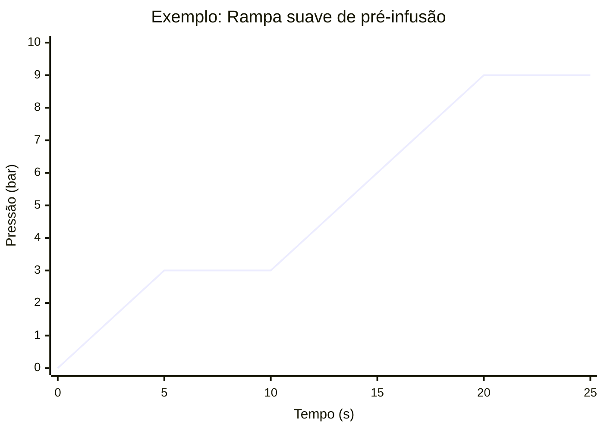
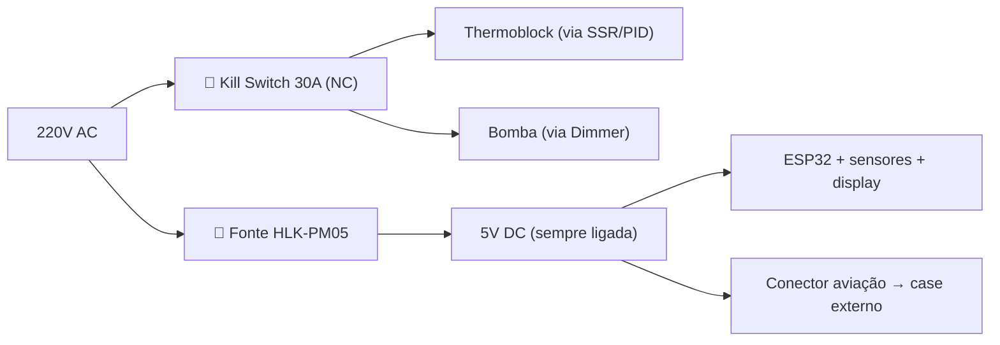

# Atuadores

Detalhamento dos atuadores e elementos de controle do projeto.

---

## 1. SSR — Controle PID da Caldeira

### Propósito
Controlar a temperatura da caldeira via PID, substituindo o termostato bimetálico original (que causa oscilações de ±10°C).

### Especificações
- **Tipo**: SSR-40DA (Solid State Relay)
- **Entrada**: 3-32V DC
- **Saída**: 24-380V AC, 40A
- **Chaveamento**: Zero-crossing

### Funcionamento
- O ESP32 gera um sinal PWM de baixa frequência (~1-2Hz)
- O duty cycle é controlado pelo algoritmo PID
- O SSR liga/desliga a resistência da caldeira proporcionalmente
- Zero-crossing minimiza interferência eletromagnética

### PID
- **Setpoint**: Temperatura alvo (ex: 93°C para espresso)
- **Entrada**: Leitura do PT100 via MAX31865
- **Saída**: PWM para o SSR (0-100% duty)
- **Parâmetros**: Kp, Ki, Kd — calibrar experimentalmente
- Usar window-based PID (período de ~1-2s)

### Biblioteca
- `PID` by Brett Beauregard (Arduino PID Library)
- Ou implementação custom com anti-windup

### Segurança
- Manter o termostato bimetálico original como **backup de segurança** (em série com o SSR)
- Limite de temperatura máxima no firmware (ex: 130°C → desliga tudo)
- Watchdog no ESP32 para desligar SSR em caso de travamento

---

## 2. Dimmer AC — Controle da Bomba (Pré-infusão)

### Propósito
Controlar a potência da bomba vibratória para pré-infusão suave e perfis de pressão customizados.

### Especificações
- **Módulo**: RobotDyn AC Dimmer (ou equivalente com detecção zero-crossing)
- **Capacidade**: 3.3A / 600W (suficiente para bomba de ~50W)
- **Controle**: Fase (0-100%)
- **Zero-crossing**: Detecção integrada

### Funcionamento
1. O módulo detecta o zero-crossing da rede AC
2. O ESP32 recebe a interrupção de zero-crossing
3. Após um delay programável, o ESP32 envia um pulso de gate ao TRIAC
4. Maior delay = menor potência = menor pressão

### Perfis de Pré-infusão

### Perfis Programáveis
- **Rampa linear**: Pressão sobe gradualmente de 0 a 9 bar
- **Pré-infusão + extração**: 3 bar por 5s → 9 bar
- **Blooming**: Pulsação a baixa pressão por 10s → 9 bar
- **Pressure profiling**: Curva custom definida pelo usuário

### Biblioteca
- `RBDdimmer` (para módulos RobotDyn)
- Ou controle manual via interrupts (mais flexível)

---

## 3. Relés — Botões e Kill Switch

### 3.1 Módulo Relé 3 Canais — Botões do Painel

### Propósito
Substituir os botões físicos do painel por triggers digitais.

### Especificações
- **Módulo**: Relé 3 canais (ou módulo 4ch usando apenas 3), 5V, optoacoplador isolado
- **Capacidade**: 10A/250V AC por canal
- **Trigger**: LOW level (ativo em LOW)

### Mapeamento dos Canais

| Canal | Função | Descrição |
|---|---|---|
| Relé 1 | Botão Café | Simula pressionar o botão de café/espresso |
| Relé 2 | Botão Vapor | Simula pressionar o botão de vapor |
| Relé 3 | Botão Leite | Simula pressionar o botão de leite |

### Instalação
- Soldar fios em paralelo aos botões originais no painel
- O relé "simula" o pressionamento do botão fechando o contato

### 3.2 Relé AC 30A — Kill Switch de Segurança

### Propósito
Corte físico de emergência da parte de potência da máquina (thermoblock e bomba). **Não é o controle principal de liga/desliga** — o ESP32 já controla aquecimento via SSR e bomba via dimmer.

### Especificações
- **Tipo**: Relé individual 30A (ou contator)
- **Conexão**: NC (normalmente fechado) — potência passa por padrão
- **Capacidade**: 30A/250V AC

### Quando é acionado
- Comando de emergência via MQTT / interface web
- Detecção de falha crítica pelo firmware (temperatura excessiva, SSR travado)
- Manutenção remota

### Comportamento
- **NC (normalmente fechado)**: potência AC passa normalmente para thermoblock e bomba
- Se o ESP32 reiniciar: máquina **continua operando** (relé NC mantém contato fechado)
- ESP32 aciona o relé para **cortar** energia em caso de emergência
- Fonte DC permanece ligada independentemente — ESP32 sempre online para comandos remotos

### Arquitetura de energia

> **Nota**: O controle funcional (ligar/desligar aquecimento e bomba) é feito pelo ESP32 via SSR e dimmer. O kill switch é apenas uma camada adicional de segurança para corte físico total da parte de potência.

---

## 4. OPV (Over Pressure Valve) — Ajuste Mecânico

### Propósito
Limitar a pressão máxima da bomba a 9 bar (padrão para espresso).

### Contexto
A bomba vibratória original opera a ~15 bar. O OPV regula a pressão máxima que chega ao grupo. Na máquina original, geralmente está ajustado para ~12-15 bar.

### Ajuste
1. Identificar a válvula OPV na máquina (geralmente na saída da bomba)
2. Ajustar a mola interna ou parafuso para limitar a 9 bar
3. Validar com o manômetro digital instalado
4. Usar blind basket (filtro cego) para teste de pressão estática

### Validação
- Com o manômetro digital conectado, a pressão deve estabilizar em ~9 bar com filtro cego
- Se a máquina tiver OPV ajustável por parafuso, usar chave Allen
- Se for mola, pode ser necessário cortar espiras ou substituir a mola
