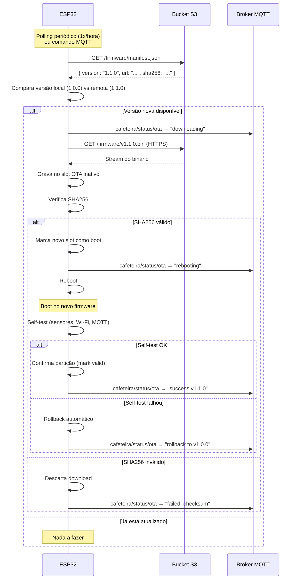

# OTA (Over-The-Air Updates)

## Visão Geral

O firmware do ESP32 é atualizado remotamente via OTA, baixando binários de um **bucket S3**. O esquema de partição dual (OTA0/OTA1) garante rollback automático em caso de falha.

## Esquema de Partições (16 MB Flash — N16R8)

| Partição | Tipo | Offset | Tamanho | Descrição |
|---|---|---|---|---|
| nvs | data/nvs | 0x9000 | 16 KB | Configurações persistentes |
| otadata | data/ota | 0xD000 | 8 KB | Controle de boot OTA |
| ota_0 | app/ota_0 | 0x10000 | 6.5 MB | Slot de firmware A |
| ota_1 | app/ota_1 | 0x690000 | 6.5 MB | Slot de firmware B |
| spiffs | data/spiffs | 0xD10000 | ~2.5 MB | LittleFS (web UI + histórico) |

> Com 6.5 MB por slot, há espaço de sobra para LVGL, WebSocket, PID e toda a lógica de extração.

## Estrutura no Bucket S3

```
s3://iot-cafeteira/
├── firmware/
│   ├── manifest.json          ← versionamento
│   ├── v1.0.0.bin
│   ├── v1.1.0.bin
│   └── latest.bin             ← symlink/cópia do mais recente
└── web/
    └── webui.bin              ← (opcional) atualização da interface web separada
```

### manifest.json

```json
{
  "version": "1.1.0",
  "url": "https://iot-cafeteira.s3.amazonaws.com/firmware/v1.1.0.bin",
  "sha256": "a1b2c3d4e5f6...",
  "size": 1843200,
  "release_notes": "Melhoria no PID e correção do dimmer",
  "min_version": "1.0.0",
  "published_at": "2026-04-30T20:00:00Z"
}
```

## Fluxo de Atualização



## Triggers de Atualização

A verificação de OTA pode ser disparada de duas formas:

### 1. Polling periódico

O ESP32 consulta o `manifest.json` a cada **1 hora** (configurável). Evita fazer OTA durante uma extração em andamento.

### 2. Comando MQTT

```
Tópico:    cafeteira/cmd/ota
Payload:   { "action": "check" }       ← verifica se há atualização
           { "action": "update" }      ← força atualização imediata
           { "action": "rollback" }    ← volta para versão anterior
```

## Tópicos MQTT para OTA

| Tópico | Direção | Payload | Descrição |
|---|---|---|---|
| `cafeteira/status/ota` | ESP → Broker | `{ "status": "...", "version": "..." }` | Estado atual do OTA |
| `cafeteira/cmd/ota` | Broker → ESP | `{ "action": "check\|update\|rollback" }` | Comandos de OTA |
| `cafeteira/info/firmware` | ESP → Broker | `{ "version": "1.0.0", "build": "...", "partition": "ota_0" }` | Info do firmware atual |

## Configuração do Bucket S3

### Permissões

O bucket precisa apenas de **leitura pública** nos objetos de firmware (ou usar URLs pré-assinadas):

```json
{
  "Version": "2012-10-17",
  "Statement": [
    {
      "Effect": "Allow",
      "Principal": "*",
      "Action": "s3:GetObject",
      "Resource": "arn:aws:s3:::iot-cafeteira/firmware/*"
    }
  ]
}
```

> **Alternativa**: usar URLs pré-assinadas com validade de 1h, obtidas via MQTT/API intermediária, para maior segurança.

### HTTPS obrigatório

O ESP32 deve validar o certificado TLS do S3. Incluir o certificado raiz da Amazon no firmware ou usar o bundle de certificados do `esp_tls`.

## Self-Test pós-OTA

Após boot com novo firmware, o ESP32 executa um self-test antes de confirmar a partição:

1. ✅ Wi-Fi conectado
2. ✅ MQTT conectado
3. ✅ Sensores respondendo (PT100, pressão, HX711)
4. ✅ Display inicializado
5. ✅ LittleFS montado

Se qualquer verificação falhar em **30 segundos**, o ESP32 faz rollback automático para o slot anterior.

## Segurança

- **HTTPS obrigatório** — todo tráfego com S3 via TLS
- **Verificação SHA256** — integridade do binário baixado
- **Secure Boot** (opcional) — assinar firmware com chave privada, ESP32 verifica assinatura antes de aplicar
- **Anti-rollback** (opcional) — impedir downgrade para versões com vulnerabilidades conhecidas
- **Sem credenciais no firmware** — se usar URLs pré-assinadas, obtê-las via canal MQTT seguro
